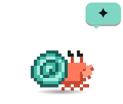
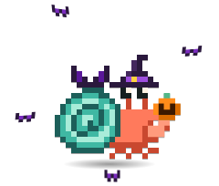
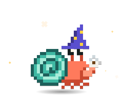
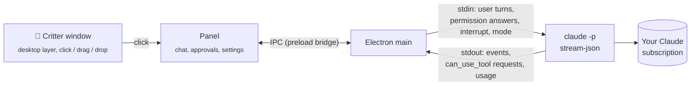

<div align="center">

# Shellby

[](https://github.com/x-salmon/shellby/releases/latest)  [](https://github.com/x-salmon/shellby/releases) [](LICENSE)

**A pixel hermit crab who lives on your Windows desktop and gets things done with Claude Code.**

Give him a task and he scuttles off, sends out helper crabs and builds his own tools,<br>
all on **your own Claude Pro or Max plan**. No API keys, no per-token billing.<br>
No Claude? He's still a desk pet who watches your PC, dresses up and earns trophies.

**[Download for Windows](https://github.com/x-salmon/shellby/releases/latest)** · [Community packs](https://x-salmon.github.io/shellby-packs/) · [How it works](#how-it-works) · [Skins](docs/SKINS.md) · [Security](SECURITY.md) · [Changelog](CHANGELOG.md)

<br>


<sub>Give him a task, watch the helper crabs go, earn outfits. ([MP4 version](docs/shellby-demo.mp4))</sub>

</div>

---

## Get started

1. **[Download the installer](https://github.com/x-salmon/shellby/releases/latest)** (`Shellby-Setup-x.y.z.exe`) and run it on Windows 10 or 11.
2. Pick **Just the crab** (no account needed) or **Crab + Claude Code** (uses your Claude Pro or Max plan).
3. He moves onto your desktop. Click him to open the panel.

Windows may show a SmartScreen warning the first time; [Install](#install) explains it, along with the Claude Code setup.

## 🦀 He lives on your desktop

<p align="center">
    
</p>

- **On the wallpaper layer:** behind every window, and still there after <kbd>Win</kbd>+<kbd>D</kbd>.
- **Shows you what's happening:** he scuttles while Claude works, raises a claw when it needs you, celebrates when it's done and naps when it's quiet.
- **He has a voice:** a few words of his own in his bubble, about the work he's actually doing — *"fingers crossed"* at a test run, *"all green!"* when it passes, *"this file again?"* on the third visit. He says good morning, notices when you've been away, and mutters to himself when it's quiet. Dial him from **Quiet** to **Chatty** in **Settings → Look**, and he always hushes while guarding your focus.
- **Little habits:** left alone he digs at your wallpaper, buffs his shell, peeks at what you're doing, stretches or flops over. Your crab also has one of four temperaments, picked once and kept, which colours what he says and what he gets up to.
- **Drop files on him** to hand them to a task.
- **Pet him** by rubbing the mouse back and forth over him. **Flick him** while dragging and he tumbles across the screen and lands on the taskbar. When he's idle he strolls around his spot a little.
- **He guards your focus:** right-click him → **Guard my focus** (15, 25 or 50 minutes). He puts on a helmet, holds back the notifications that can wait, and takes a break with you when time's up.
- **Wandered off-screen?** **Settings → Look → Find Shellby** brings him back.

## 🎩 Dress him up

<p align="center">
  
</p>

- **He grows into new shells:** level 3 brings a Snail Shell, then a Tin Can, a Teacup, a Toy Brick and the Golden Conch at level 20. Each one is a little molt on your desktop: out of the old shell, a shiver, into the new one. Pick any home you've grown into under **Outfits → Homes**.
- **41 accessories and 7 effects** for his hat, face, neck, claw and shell. They move with him: a pumpkin swings with his claw.
- **Seasons:** he dresses up for Halloween, winter, Valentine's, spring, summer and autumn, and seasonal items are yours to keep.
- **26 trophies**, a few of them secret, unlock outfits as you use him. Or flip **Unlock everything**.
- **XP and levels,** from Hatchling to Legend of the Tides. Writing himself a new skill earns the most.
- **Outfit codes** like `SHB-B1T7-2DB1-7MXH-JW90` share a look, and a **📸 crab card** shows him off.

<table>
<tr>
<td width="50%"></td>
<td width="50%"></td>
</tr>
</table>

<details>
<summary><b>XP, trophies, streaks and outfit codes in detail</b></summary>

- **XP sources:** a new skill or agent he writes for himself (+150, usually a level-up), deploys (+50), pushes (+40), passing tests (+25), trophies (+20), focus sessions (+15) and finished tasks (+10). It counts in Shellby and, with the plugin, in your terminal too. "+25 XP" floats up from him on the desktop, and hourly caps stop a test loop from farming it. Level-ups get their own celebration.
- **Trophies & XP:** click the yellow level badge next to him in the title bar to see his level, an XP log and your streak.
- **Trophy examples:** finish 10 tasks for a hard hat, send out your first helper for a captain's hat, let him run a script he built himself for a wrench, finish a task after midnight for a nightcap, free up a full drive for a broom. Unlocks celebrate on your desktop with confetti.
- **Streaks and nudges:** finish a Claude task on consecutive days for a 🔥 streak (it's in the status line too). Shellby remembers the git repos you work in, and when one goes quiet you get a nudge: *"You haven't committed to 3d-rack in 5 days 🐚"*. **Pick it up** opens a tab there with a "where did we leave off?" prompt. At most one nudge a day, only in the daytime, and each project can be muted.
- **Seasons in detail:** he gives the season back if you change his look. Seasonal items are collectibles, so be around while the season is on to keep them.
- **Helper crabs wear matching hats,** and every crab in the app is dressed the same way.
- **Outfit codes:** paste someone's code into **Wear a code…** and Shellby previews it on your crab, then puts it on. Locked items show which trophy unlocks them, and items from packs you don't have come with a **Get pack** button. Codes are typo-proof and need no server.
- **Crab card:** **📸 Share** on Shellby's screen makes a card with Shellby as he's dressed, your best trophy, task count and trophy shelf. It's copied to your clipboard and saved to `Pictures\Shellby`. Sharing one earns a trophy too.

<p align="center"></p>

</details>

### Community wardrobe

<a href="https://x-salmon.github.io/shellby-packs/"></a>

More hats, effects and colors from other people at **[x-salmon.github.io/shellby-packs](https://x-salmon.github.io/shellby-packs/)**.

- **Install in one click:** every item is previewed on a live Shellby, and the app shows exactly what a pack contains before it installs.
- **Safe by design:** packs are pixel art and settings in JSON, so they can't run code, and each download is checked against the gallery's SHA-256.
- **Make your own** in [Pack Studio](https://x-salmon.github.io/shellby-packs/studio.html), then share it with a pull request on [x-salmon/shellby-packs](https://github.com/x-salmon/shellby-packs). The format is in [docs/ADDONS.md](docs/ADDONS.md) ([JSON Schema](docs/addon.schema.json)).

## 🩺 He watches your PC

<p align="center">
  
</p>

- **Live vitals:** GPU and CPU temperature and load, memory, and every drive, with 10-minute sparklines.
- **His mood follows your hardware:** he sweats past 80°C, gets dizzy when memory fills up, and overstuffs his shell when a drive is full.
- **One notification per problem,** and another when it's fixed. You set the thresholds.
- **"Ask Shellby why"** runs a read-only Claude task that finds the cause and reports back.

<p align="center"></p>

<details>
<summary><b>How Health works</b></summary>

- Everything is read locally, with no admin rights needed. NVIDIA GPUs work out of the box through `nvidia-smi`.
- **CPU temperature** comes from [LibreHardwareMonitor](https://github.com/LibreHardwareMonitor/LibreHardwareMonitor)'s local web server, because Windows won't give it to normal apps. The Health view walks you through the setup.
- Readings must stay over the line for about 20 seconds, so a loading-screen spike doesn't count. Past 88°C he pants under a heat shimmer, and it wakes him up if he's asleep.
- "Ask Shellby why" never deletes or kills anything. You can also turn the desktop reactions off and keep only the dashboard.
- More in [docs/HEALTH.md](docs/HEALTH.md).

</details>

## ⚡ He gets things done with Claude Code

<table>
<tr>
<td width="50%"></td>
<td width="50%"></td>
</tr>
<tr>
<td align="center"><sub>Helpers work in parallel, each in its own lane</sub></td>
<td align="center"><sub>Skills and agents he builds show up in his Toolbox</sub></td>
</tr>
</table>

- **Helper crabs:** each subagent gets its own lane in the panel and its own crab on your desktop.
- **Parallel tabs,** each its own Claude Code process. Keep typing while he works and your messages queue up.
- **Toolbox:** every skill, agent, command and MCP server Claude Code can use. When he writes himself a new one, he celebrates.
- **Skill Shop** installs plugins from Claude Code's marketplaces, asking first every time.
- **Routines** run tasks on a schedule, like "every Friday at 5, tidy Downloads".
- **Hit your usage limit?** He naps with a countdown to the reset, then wakes up and taps you the moment your 5-hour or weekly limit resets, even if your PC was asleep.
- **Works everywhere you use Claude Code:** with the plugin he reacts to your terminal and VS Code sessions too, and shows up in Claude Code's status line.

<details>
<summary><b>The details</b></summary>

- **The plugin:** one click in **Settings → Claude Code everywhere**, or `/plugin marketplace add x-salmon/shellby` then `/plugin install shellby@shellby` in Claude Code. He scuttles while Claude works, raises a claw when it needs permission, celebrates finished turns and sends out helper crabs for subagents. See [claude-plugin/](claude-plugin/).
- **Crew view:** each helper's lane shows its task, live activity, tool count, tokens and time. Click a helper crab on the desktop to jump to its conversation. When a helper needs permission, the card shows up in its lane, labelled with which crab is asking.
- **Status line:** `🦀💨 Shellby working · Lv 5 Claw Coder ▰▰▰▱▱ · 🥵 GPU 84°C · +25 XP`, right under the prompt in the terminal and VS Code. Turn it on in **Settings → Claude Code everywhere → Status line** (it asks first, keeps a backup, and restores your old status line if you remove it), or run `/shellby:statusline`. In the classic cmd.exe console, which can't draw emoji, it switches to a plain-text line.
- **Queue:** Enter queues a message while he's busy, and it's sent when the current turn finishes. Click a queued message (or press <kbd>↑</kbd>) to edit it. Stopping hands the queue back to you instead of firing it.
- **Tabs:** build a tool in one tab while you use it in another. The desktop crab shows how many are running. <kbd>Ctrl</kbd>+<kbd>T</kbd>, <kbd>Ctrl</kbd>+<kbd>W</kbd> and <kbd>Ctrl</kbd>+<kbd>Tab</kbd> work like a browser.
- **Toolbox:** MCP servers show their connection status. New skills and agents are tagged **new** and can be pinned as one-click chips on the start screen, and <kbd>/</kbd> in the composer autocompletes all of them.
- **Skill Shop:** **Toolbox → Get more** lists every plugin in your marketplaces, most popular first. Add marketplaces from GitHub, and every install asks first in an isolated confirmation window. It uses Claude Code's own plugin system, so whatever you install works in your terminal and editor too.
- **Routines:** each run opens its own tab with its own permission mode, and missed runs catch up when your PC wakes up.

</details>

## 🧭 Easy to get around

- **A bar along the bottom:** Shellby, Chat, Toolbox, Routines, Health and History, labeled, with the current screen lit up.
- **<kbd>Ctrl</kbd>+<kbd>K</kbd> jumps anywhere:** any screen, Settings section, permission mode, past conversation or skill.
- **<kbd>Ctrl</kbd>+<kbd>1</kbd>–<kbd>6</kbd>** for the bar, <kbd>Esc</kbd> goes back up one level, and Settings has section links that stay on screen as you scroll.
- **Also:** <kbd>Ctrl</kbd>+<kbd>Alt</kbd>+<kbd>Space</kbd> opens him from anywhere, plus a live 5-hour and weekly usage meter, resumable history, a tray menu, notifications, auto-updates and [custom skins](docs/SKINS.md).

## 🔒 You stay in control

- **Permission cards:** **Allow**, **Always allow** or **Deny**, with <kbd>Y</kbd> / <kbd>A</kbd> / <kbd>N</kbd>. Claude's multiple-choice questions get cards too: press <kbd>1</kbd>–<kbd>9</kbd>, pick several, type your own answer, or **Skip**.
- **Self-built tooling gets flagged:** the card warns you when a command runs a script Claude wrote earlier in the conversation, or an edit touches Claude Code's own setup (skills, agents, hooks, settings, `CLAUDE.md`).
- **Five permission modes,** from Ask first to a fenced-off Autonomous. See [Permission modes](#permission-modes).
- **Your plan, your PC:** no API keys, no telemetry, and your history stays on your PC.

### GitHub sign-in (optional)

Sign in with a short code you approve on github.com, with no password typed into Shellby. GitHub is only asked for what the features you turn on need:

- **Sync between PCs:** trophies, collected items, XP, streak days, outfit and color, through a private gist. Syncing only ever adds progress.
- **Watch CI on your pull requests:** when a build goes red he holds up a ✗ sign, when it's fixed he dances, and a review request makes him raise a claw. **Ask Shellby why** reads the failing logs and explains them without changing anything. Needs nothing beyond the sign-in for public repos; private ones need "Let Claude tasks push" too.
- **Publish your Wardrobe packs** to the community gallery: Shellby forks it and opens the pull request for you.
- **Let Claude tasks push:** Shellby's tabs get your sign-in for `git push`/`pull`, `gh` and the official GitHub plugin. Off by default, with a warning before it's turned on.

Your name and avatar show in Settings and on your crab card. The sign-in is encrypted by Windows and never stored in settings.json.

## Install

**Just the crab:** download **Shellby-Setup-x.y.z.exe** (or the portable build) from [Releases](https://github.com/x-salmon/shellby/releases/latest), run it, and pick **Just the crab**. That's it: Health, the Wardrobe, trophies and crab cards, no account. You can add Claude Code later from Settings.

**Crab + Claude Code:**

1. **Install Claude Code** and sign in with your Claude account (Pro or Max):
   ```powershell
   npm install -g @anthropic-ai/claude-code
   claude auth login
   ```
2. Download **Shellby-Setup-x.y.z.exe** (or the portable build) from [Releases](https://github.com/x-salmon/shellby/releases/latest) and run it.
3. Shellby walks you through a two-step check (CLI found ✓, signed in with a Claude account ✓) and asks how much freedom he gets.

> **"Windows protected your PC"?** That's Microsoft SmartScreen. It warns about any app that isn't code-signed or that few people have downloaded yet, and Shellby releases aren't signed yet.
>
> - **To install anyway:** click **More info → Run anyway**.
> - **To check you got the real file:** every release is built by [GitHub Actions](https://github.com/x-salmon/shellby/actions/workflows/release.yml) from the tagged commit, and each one lists SHA-256 checksums in `SHA256SUMS.txt`. Compare them with `Get-FileHash .\Shellby-Setup-x.y.z.exe`, or build from source (below).

**Requirements:** Windows 10 or 11 (x64), Claude Code 2.1+, and a Claude Pro or Max plan.

## How it works



Shellby doesn't talk to any AI API itself. Each conversation is one long-lived Claude Code process:

```
claude -p --input-format stream-json --output-format stream-json --verbose
       --permission-prompt-tool stdio --permission-mode <mode> [--resume <id>]
```

<details>
<summary><b>Protocol details</b></summary>

- **Tasks** go in as JSON user messages on stdin. One process holds the whole conversation, so follow-ups keep context.
- **Permission prompts** come out as `control_request { subtype: "can_use_tool" }` and Shellby answers with `allow` / `deny` (plus the suggested rules for "Always allow"). This is the same host protocol the Claude Agent SDK uses.
- **Stop** sends an `interrupt` control request, and falls back to killing the process tree if the CLI doesn't wind down.
- **Mode changes** mid-conversation send `set_permission_mode`.
- **Subagents** come through as `task_started` / `task_progress` / `task_notification` system events. Their messages carry `parent_tool_use_id`, the Agent call that spawned them, and their permission prompts carry `agent_id`, which equals the `task_id`. That's all it takes to route every event, prompt and helper crab to the right lane.
- **The toolbox** merges the skills, agents, commands and MCP servers reported in Claude Code's `init` event with a scan of `~/.claude` and the project's `.claude/`. A file watcher on those folders is how Shellby notices new tricks.
- **Billing safety:** before spawning the CLI, Shellby strips `ANTHROPIC_API_KEY`, `ANTHROPIC_AUTH_TOKEN`, `ANTHROPIC_BASE_URL` and the Bedrock/Vertex/Foundry switches from its environment, and onboarding checks `claude auth status` for a `claude.ai` login. Usage counts against your plan's normal limits, exactly as if you'd typed the task into a terminal.

**Staying on the desktop layer:** the critter window is made an *owned window* of the shell's desktop host (the `Progman`/`WorkerW` window that contains `SHELLDLL_DefView`), via [koffi](https://koffi.dev) FFI calls into `user32.dll`. Owned windows share their owner's z-order band, so he sits above your wallpaper and icons and below every app. A `TaskbarCreated` hook re-pins him when Explorer restarts, and a slow watchdog covers anything else.

</details>

## Permission modes

| Mode | Reads | Edits files | Runs commands | Notes |
|---|---|---|---|---|
| **Ask first** *(default)* | ✅ | asks | asks | Recommended. |
| **Smart** | ✅ | auto* | auto* | Claude Code's `auto` mode: a safety classifier approves routine steps and blocks risky ones. |
| **Auto-edit** | ✅ | ✅ | asks | |
| **Plan only** | ✅ | ✗ | ✗ | Shellby proposes a plan card, and nothing changes until you approve. |
| **Autonomous** | ✅ | ✅ | ✅ | `bypassPermissions`. Behind an explicit warning, never the default. |

Your own Claude Code allow/deny rules in `~/.claude/settings.json` still apply in every mode.

## Build from source

`git clone`, `npm install`, `npm start`. The full setup, every test and maintenance script, and a map of the code are in [docs/DEVELOPMENT.md](docs/DEVELOPMENT.md).

## Privacy

Everything stays on your PC. Conversation history lives in `%APPDATA%\Shellby\sessions`, and Shellby has no telemetry and no servers. The only network traffic is Claude Code talking to Anthropic, the updater checking GitHub Releases, community pack downloads you ask for, GitHub (only if you sign in: your profile, the sync gist, pack pull requests, the CI status of your open pull requests), and Health asking LibreHardwareMonitor for sensor readings on `127.0.0.1`. That last one never leaves your PC. See [SECURITY.md](SECURITY.md) for the renderer sandboxing details.

## Contributing

Skins, bug reports and PRs are welcome. See [CONTRIBUTING.md](CONTRIBUTING.md).

## Disclaimer

Shellby is an independent open-source project. It is **not affiliated with, endorsed by, or sponsored by Anthropic**. "Claude" and "Claude Code" are trademarks of Anthropic, PBC. Shellby only automates the official Claude Code CLI you install and sign in to yourself, and your use of it is subject to [Anthropic's terms](https://www.anthropic.com/legal/consumer-terms).

Shellby acts on your real files with your real permissions. Read what you approve, and keep backups.

<sub>MIT licensed. The bundled fonts, Pixelify Sans, Atkinson Hyperlegible and Martian Mono, are under the SIL Open Font License 1.1 (see [assets/fonts](assets/fonts)).</sub>
