<div align="center">

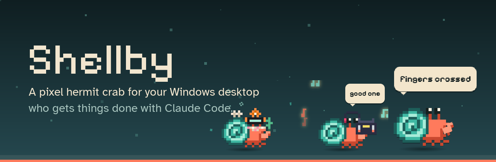

[](https://github.com/x-salmon/shellby/releases/latest)  [](https://github.com/x-salmon/shellby/releases) [](LICENSE)

Give him a task and he scuttles off, sends out helper crabs and builds his own tools,<br>
all on **your own Claude Pro or Max plan**. No API keys, no per-token billing.<br>
No Claude? He's still a desk pet who talks, plays, digs you up gifts, remembers you, watches your PC and dresses up.

### [⬇ Download for Windows](https://github.com/x-salmon/shellby/releases/latest)

[What's new](#whats-new) · [Community packs](https://x-salmon.github.io/shellby-packs/) · [How it works](#how-it-works) · [Skins](docs/SKINS.md) · [Security](SECURITY.md) · [Changelog](CHANGELOG.md)

<br>

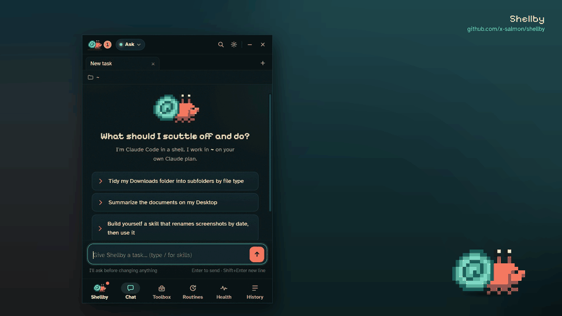

<sub>Give him a task, watch the helper crabs go, earn outfits. ([MP4 version](docs/shellby-demo.mp4))</sub>

</div>

---

## Get started

1. **[Download the installer](https://github.com/x-salmon/shellby/releases/latest)** (`Shellby-Setup-x.y.z.exe`) and run it on Windows 10 or 11.
2. Pick **Just the crab** (no account needed) or **Crab + Claude Code** (uses your Claude Pro or Max plan).
3. He moves onto your desktop. Click him to open the panel.

Windows may show a SmartScreen warning the first time; [Install](#install) explains it, along with the Claude Code setup.

## What's new

<table>
<tr>
<td width="33%" valign="top">

**🎭 A life of his own** · 0.55<br>
<sub>Little scenes when nothing's happening: he pounces on your cursor and misses, builds a sandcastle, gets the hiccups. He notices your day too: <i>"gg"</i> after a game, quiet on a call.</sub>

</td>
<td width="33%" valign="top">

**🐚 Gifts from digging** · 0.55<br>
<sub>He digs at your wallpaper and turns things up: sea glass, a lost key, a pearl, once in a long while a gold doubloon. 38 finds, six sets, a shelf to fill.</sub>

</td>
<td width="33%" valign="top">

**💞 He remembers you** · 0.55<br>
<sub>A bond that grows, a story of your moments together (<i>"remember Chrome?"</i>), your birthday, hide and seek, fetch, and visiting crabs who chat back.</sub>

</td>
</tr>
<tr>
<td width="33%" valign="top">

**⚡ Workflows** · 0.50<br>
<sub>A red build, a release, a new file or the clock starts a list of steps: Claude (handing back real data), commands, web requests, questions for you. Describe one and Claude writes it. [How](docs/WORKFLOWS.md)</sub>

</td>
<td width="33%" valign="top">

**🏷️ A sticker for everything you ship** · 0.44<br>
<sub>Push a project for the first time and he slaps its sticker on his shell. Ship it again and it goes vinyl, holo, then foil.</sub>

</td>
<td width="33%" valign="top">

**⌨️ A `shellby` command** · 0.20<br>
<sub><code>shellby do "tidy my Downloads"</code> from any terminal, and an MCP server so Claude can talk through him on purpose.</sub>

</td>
</tr>
<tr>
<td valign="top">

**📱 Your phone, in one scan** · 0.21<br>
<sub>A permission prompt, a finished run or a red build can reach your phone. ntfy is one QR code; Telegram finds your chat by itself.</sub>

</td>
<td valign="top">

**🎧 He listens along** · 0.20<br>
<sub>Spotify, a browser tab, anything in the volume flyout: he puts his headphones on and has the odd word about it.</sub>

</td>
<td valign="top">

**🎥 On stream, 💡 on your desk** · 0.20<br>
<sub>An OBS browser source with a transparent background, and OpenRGB lighting that follows his mood. Shellby installs OpenRGB for you.</sub>

</td>
</tr>
</table>

## 🦀 He lives on your desktop

<p align="center">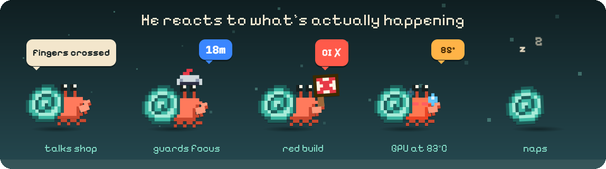</p>

- **On the wallpaper layer:** behind every window, and still there after <kbd>Win</kbd>+<kbd>D</kbd>.
- **Shows you what's happening:** he scuttles while Claude works, raises a claw when it needs you, celebrates when it's done and naps when it's quiet.
- **He has a voice:** a few words of his own in his bubble, about the work he's actually doing — *"fingers crossed"* at a test run, *"all green!"* when it passes, *"shipped it"* after a push, *"this file again?"* on the third visit. He says good morning, notices when you've been away, and mutters to himself when it's quiet. He never quotes Claude; the lines are all his.
- **A temperament of his own:** chipper, fussy, cocky or sleepy, picked once from your install and kept. It adds lines (a cocky crab says *"obviously"*) and colours his idle habits: digging at your wallpaper, buffing his shell, peeking at what you're doing, stretching, flopping over.
- **Awake while you're here:** your own keyboard and mouse keep him up, and he naps when you step away (and now and then because he felt like it). His eyes follow your cursor.
- **Pet him** by rubbing the mouse back and forth over him. **Flick him** while dragging and he tumbles across the screen and lands on the taskbar. When he's idle he strolls around his spot a little.
- **He climbs onto your windows.** Every so often he eyes up the window you're using, crouches, and hops onto its title bar (with a somersault if it's far). Up there he potters along the bar, sits on the edge swinging his legs, and peers down at what you're doing. Drag the window and he hangs on, leaning into the wind; shake it and he's flung off and lands seeing stars. Close it under him and he hangs in mid-air for a beat, looks down, and drops (onto the window below, if there is one), then walks home. Throw him at a title bar and he catches it. He keeps clear of the close button, never goes near fullscreen games or presentations, and lets clicks through to the title bar around him. Right-click him up there for **Hop down** or **Not on this app**; **Settings → Shellby** sets how often he climbs, or turns it off.
- **He guards your focus:** right-click him → **Guard my focus** (15, 25 or 50 minutes). He puts on a helmet, counts down, holds back the notifications that can wait, and takes a break with you when time's up.
- **He listens along:** when something's playing he puts his headphones on, with the odd *"good one"*. Read from Windows itself, so there's no account and nothing leaves your PC.
- **Drop files on him** to hand them to a task, or **paste a screenshot** (Win+Shift+S, then Ctrl+V) straight into the box: Claude sees the picture itself. **Wandered off-screen?** **Settings → Look → Find Shellby** brings him back.

<details>
<summary><b>How much he talks, and when he doesn't</b></summary>

- **Settings → Look → Personality:** **Quiet** is a single mark in the bubble and never a word. **Normal** (the default) leaves at least 40 seconds between lines and has him mutter to himself now and then when nothing's happening. **Chatty** shortens the gap to 12 seconds, and he mutters and plays out his little scenes more often. **Settings → Look** also says which of the four temperaments yours is.
- **On a call he hushes:** while an app has your microphone he holds up a little "shh" sign and says nothing, and asks how it went after. Windows' own record of who's using the microphone tells him; he never listens himself.
- He never speaks while guarding your focus, never repeats a line while another one is unused, and anything that matters — a health warning, a red build, a countdown — takes the bubble back off him.
- **A chirp when he speaks,** synthesized on the spot rather than shipped as audio. Off by default, under **Settings → Look**.
- **Usage limit reached?** He naps with a countdown to the reset, then wakes up and taps you the moment your 5-hour or weekly limit resets, even if your PC was asleep.
- **Heading for it?** When your pace says you'll fill the 5-hour window before it resets, he says when: *at this pace you'll hit your 5-hour limit around 3:40 PM. It resets at 4:15 PM.* Hold a message (<kbd>Ctrl</kbd>+<kbd>Shift</kbd>+<kbd>Enter</kbd>), your queue or a routine for after the reset, and it goes by itself, even after a restart. Routines that come due while you're at the limit wait for the reset instead of failing.

</details>

## 🐚 Just the two of you

None of this needs Claude or an account. It's all on your PC.

- **Little scenes.** When nothing's happening he gets up to something: squints at your cursor, creeps up on it, pounces and misses (*"meant to do that"*); builds a sandcastle and watches it wash away; sneezes, gets the hiccups, blows bubbles, juggles pebbles, nods off, counts grains of sand. Some only happen at night, at the weekend, in their season or while music plays, and his temperament changes what he says. The **Us** page shows which of the 24 you've caught him in.
- **He notices your day.** *"gg"* when a game ends, *"numbers again?"* after most of an hour in Excel (Word and PowerPoint get their own), *"friday!"* on a Friday afternoon, a lazy line at the weekend and a groan on Monday morning. He only ever knows the *kind* of app in front, from its file name and where it's installed, never a window title or anything in it. (The one thing that reads titles is the time tracker, if you turn it on, and only to tell which project you're in.)
- **Gifts from digging.** Now and then a dig turns something up and he holds it out to you: sea glass, a bottle cap, a lost key, a pearl, a fossil, and very rarely a black pearl or a gold doubloon. 38 finds in six sets (sea glass in every colour, a pirate's hoard, the junk drawer), some only in their season or after dark, two only on special days. Right-click him → **Play → Dig for treasure** every couple of hours. They live on the shelf at **Shellby → Finds**, and the one you pick as his favourite is what he shows off.
- **He remembers you.** Petting, playing and simply keeping him around bring you closer, from *New friends* to *Inseparable*, and each step opens something up: memories, his favourite find, hearts in the sand, a lean on your cursor. It never goes back down. **Shellby → Us** keeps your story (*"You shook him off Chrome"*, *"Dug up his first find: a pearl"*), and every so often he brings one up. He counts the days (*"100 days together!"*), marks his hatch day each year, and if you tell him your birthday he makes a fuss and digs up something you can't find any other way.
- **Play with him.** **Hide and seek:** he burrows into the sand and pops up behind one of your windows (he lives on the wallpaper, so they really do hide him). Click him to find him; take too long and he peeks out over your windows, and much longer and he wins. **Fetch:** a pebble appears beside him; throw it across the screen and he scuttles after it and brings it back.
- **Crabs that chat.** When a friend's crab visits, the two of them talk, and what they say depends on both temperaments (a cocky crab meeting a fussy one is a different visit from two sleepy ones), the stickers on their shells, how much each has grown and the finds they're proudest of.
- **XP and trophies without Claude.** Petting, games, finds and growing closer all earn XP, and eleven new trophies come with outfits of their own: a sand pail, a metal detector, a leafy disguise, a friendship locket and more.

## 🎩 Dress him up

<p align="center">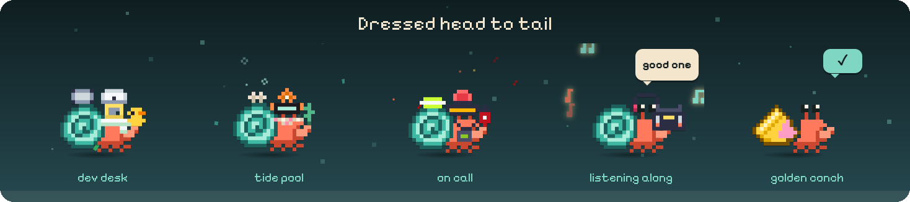</p>

- **138 accessories, 21 effects and 16 crabs** for his hat, face, neck, claw and shell. They move with him: a pumpkin swings with his claw, and eyewear scans along while he reads.
- **Head-to-tail sets:** a dev desk with a rubber duck, a tide pool he'd actually come from, and an on-call kit with a pager and an extinguisher. Each covers every slot.
- **A sticker for every project you ship:** the first time you push, deploy or release a repo (or a pull request of yours is merged), he holds up a sticker drawn for it and slaps it on his shell. More below.
- **He grows into new shells:** level 3 brings a Snail Shell, then a Tin Can, a Teacup, a Toy Brick, the Golden Conch at level 20, and on up through a Coconut Half, a Lantern Jar, a Diving Helmet, a Crystal Geode and a Treasure Chest to the Rainbow Nautilus at level 99. Each is a little molt on your desktop: out of the old shell, a shiver, into the new one. Pick any home you've grown into under **Outfits → Homes**.
- **Seasons:** he dresses up for Halloween, winter, Valentine's, spring, summer and autumn, and seasonal items are yours to keep if you're around while the season is on.
- **50 trophies**, a few of them secret, unlock outfits as you use him: the rubber duck arrives when you let him run a script he wrote, the barnacles after seven days together. Or flip **Unlock everything**.
- **XP and levels,** from Hatchling to Shellby Supreme at level 99, with a new title, badge colour or shell at least every five levels. Writing himself a new skill earns the most.
- **Outfit codes** like `SHB-B1T7-2DB1-7MXH-JW90` share a look, and a **📸 crab card** shows him off.

<p align="center">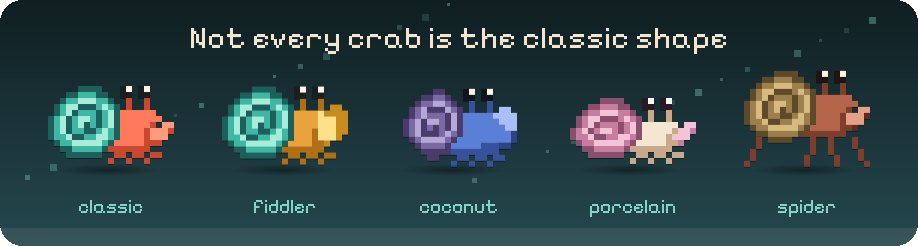</p>

<table>
<tr>
<td width="50%">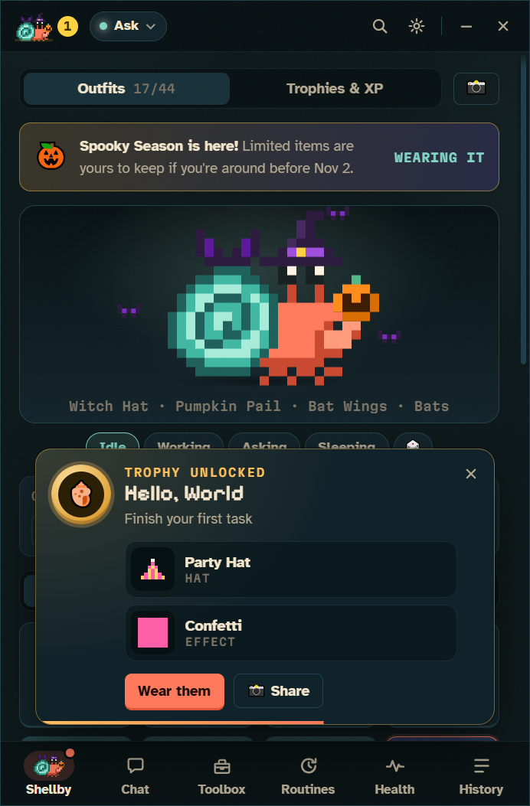</td>
<td width="50%">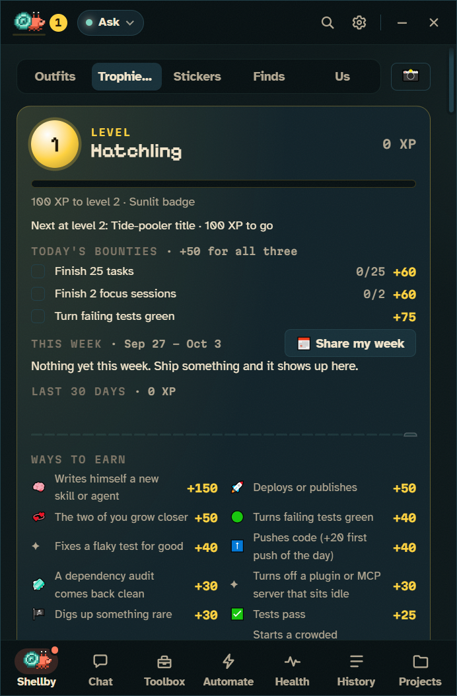</td>
</tr>
</table>

<details>
<summary><b>XP, trophies, streaks, stickers and outfit codes in detail</b></summary>

- **XP sources:** a new skill or agent he writes for himself (+150, usually a level-up), deploys (+50), turning failing tests green (+40), pushes (+40, and +20 for the first push of the day to a project), a clean dependency audit (+30, once a day per project), passing tests (+25), trophies (+20), focus sessions (+15) and finished tasks (+10). It counts in Shellby and, with the plugin, in your terminal too. "+25 XP" floats up from him on the desktop. Doing the same thing over and over within an hour pays half, then a quarter, then nothing, so a test loop can't farm it. Level-ups get their own celebration.
- **Bonuses:** a streak adds 5% a week (up to +25%), and coming back after three days or more away doubles your next 150 XP.
- **Daily bounties:** three small goals a day ("Push to 2 different projects", "Turn failing tests green"), the same three on every PC. Each pays XP, and clearing all three pays 50 more.
- **Trophies & XP:** click the level badge next to him in the title bar to see his level, what the next level unlocks, today's bounties, XP for the last 30 days and by kind, the XP log and your streak. The badge changes colour every ten levels.
- **Across PCs:** with GitHub sync on, XP earned on each PC adds up.
- **Trophy examples:** finish 10 tasks for a hard hat, send out your first helper for a captain's hat, finish a task after midnight for a nightcap, free up a full drive for a broom. Trophies hand out two or three things each, and unlocks celebrate on your desktop with confetti.
- **Streaks and nudges:** finish a Claude task on consecutive days for a 🔥 streak (it's in the status line too). Shellby remembers the git repos you work in, and when one goes quiet you get a nudge: *"You haven't committed to 3d-rack in 5 days 🐚"*. **Pick it up** opens a tab there with a "where did we leave off?" prompt. At most one nudge a day, only in the daytime, and each project can be muted.
- **Helper crabs wear matching hats,** and every crab in the app is dressed the same way.
- **Outfit codes:** paste someone's code into **Wear a code…** and Shellby previews it on your crab, then puts it on. Locked items show which trophy unlocks them, and items from packs you don't have come with a **Get pack** button. Codes are typo-proof and need no server.
- **Crab card:** **📸 Share** on Shellby's screen makes a card with Shellby as he's dressed, your best trophy, task count and trophy shelf. It's copied to your clipboard and saved to `Pictures\Shellby`. Sharing one earns a trophy too.
- **Your week:** **Trophies & XP → This week** sums up the last seven days: projects shipped, tests turned green, tasks, deploys, releases, clean audits and your streak. **📅 Share my week** makes a card in the same style, with the week's stickers on his tank, XP for each day and what shipped. On Friday afternoons after a week that shipped something, Shellby says so and the card is a click away. Projects you keep off your calling card stay off it.
- **Shell stickers:** every repo you ship leaves a mark on his shell. The sticker is drawn from the repo itself: a shape, a pattern and its first letter, in the colour of the language it's mostly written in, so the same repo gets the same sticker on every PC. Shipping counts from Shellby's tabs, from Claude Code in your terminal (with the plugin), and from pull requests merged on GitHub (with CI on). It gets shinier as you keep shipping: paper, then **vinyl** at 5 ships, **holo** at 15, **foil** at 40. Deploys and releases count double, and a burst of pushes counts once an hour. Leave a project alone for two months and its sticker starts to peel at the corner; the next ship presses it back down. Releases, deploys and merges add little marks (🚀 Live, 🥇 One-point-oh, 🔀 Merged), a clean dependency audit adds 🧼 Fresh, and there are a couple of secret ones.
- **The Sticker Book** (Shellby's screen → **Stickers**) has a page for every project: when it first shipped, how often, its marks, and **Pick up where we left off**. Click a sticker and a spot on his shell to move it (or drag it there), and stack them like a laptop lid. On a spot, <kbd>[</kbd> and <kbd>]</kbd> change which is on top, <kbd>F</kbd> flips one and <kbd>Delete</kbd> peels it off. Projects you've worked in but not shipped wait there as question marks.
- **Every shell keeps its own stickers.** When he outgrows a shell, his three most-shipped stickers come with him and the rest stay on the old one, so you can move back in any time. A repo can ship its own official sticker as [`.shellby/sticker.json`](docs/ADDONS.md#repo-stickers).
- **Friends can see them too.** With Visiting crabs on, a friend's crab arrives wearing its stickers. Nothing about yours goes on your public calling card until you choose, in the Sticker Book: **His shell** shares the stickers on his shell as patches of colour (no names or letters), and **Shell and names** adds your three most-shipped, so a friend's visit can leave you one of theirs as a swap.

<p align="center">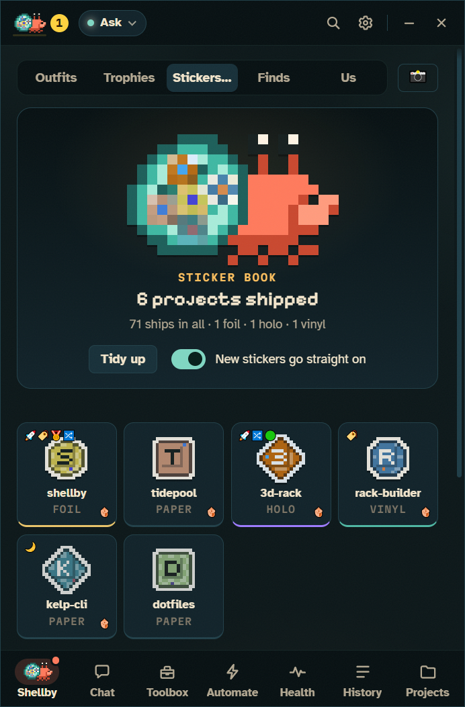 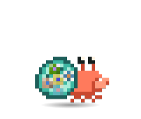</p>

<p align="center">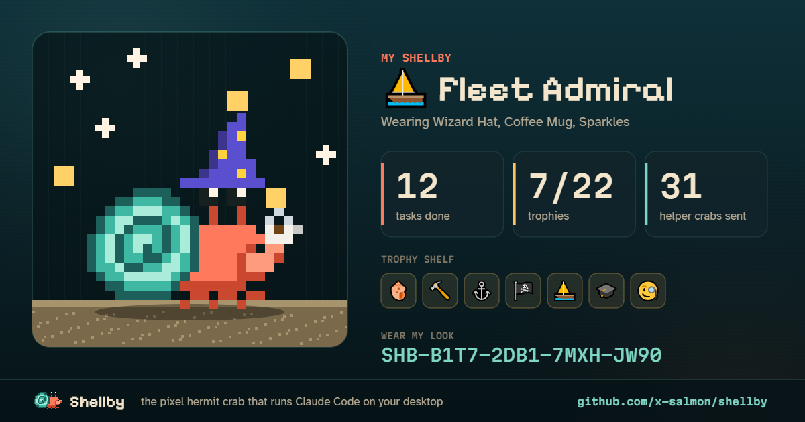</p>

</details>

### Community wardrobe

<a href="https://x-salmon.github.io/shellby-packs/">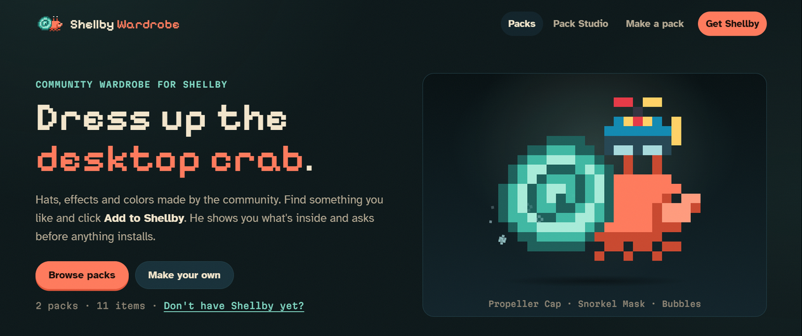</a>

More hats, effects and colors from other people at **[x-salmon.github.io/shellby-packs](https://x-salmon.github.io/shellby-packs/)**.

- **Install in one click:** every item is previewed on a live Shellby, and the app shows exactly what a pack contains before it installs.
- **Safe by design:** packs are pixel art and settings in JSON, so they can't run code, and each download is checked against the gallery's SHA-256.
- **Make your own** in [Pack Studio](https://x-salmon.github.io/shellby-packs/studio.html), then publish it from the app (Shellby forks the gallery and opens the pull request) or by hand on [x-salmon/shellby-packs](https://github.com/x-salmon/shellby-packs). The format is in [docs/ADDONS.md](docs/ADDONS.md) ([JSON Schema](docs/addon.schema.json)).

## 🩺 He watches your PC

<p align="center">
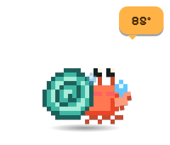 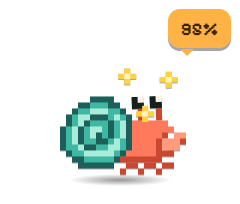 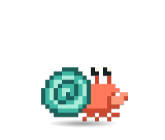
</p>

- **Live vitals:** GPU and CPU temperature and load, memory, and every drive, with 10-minute sparklines. NVIDIA, AMD and Intel cards all get their load, memory, power and fan gauges.
- **Drive temperatures, case fans and the battery** too, and a drive cooking itself gets its own warning — an NVMe throttles around 75°C and nothing else tells you.
- **What Docker, WSL and the package caches are sitting on.** On a developer's PC these are usually the biggest things on the drive. He says when there are tens of gigabytes to reclaim, and **Ask Shellby** comes back with what's safe to clear and the exact command. He never prunes or deletes anything himself.
- **His mood follows your hardware:** he sweats past 80°C, gets dizzy when memory fills up, and overstuffs his shell when a drive is full. One notification per problem, and another when it's fixed. You set the thresholds.
- **"Ask Shellby why"** runs a read-only Claude task that finds the cause and reports back.
- **What's hogging it.** While he sweats or sees stars, the busiest processes are listed right under the warning, sorted by GPU, CPU or memory, each with an **End task** that asks first.
- **What starts with Windows.** Everything that launches when you sign in, and a read-only **Ask Shellby** report on which ones you actually need.

<p align="center">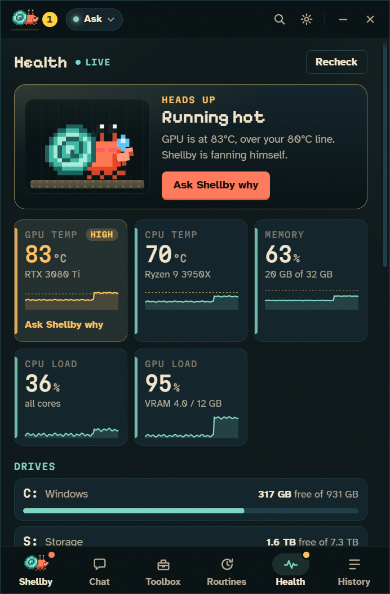</p>

<details>
<summary><b>How Health works</b></summary>

- Everything is read locally, with no admin rights needed. NVIDIA GPUs work out of the box through `nvidia-smi`.
- **CPU temperature and the rest** come from [LibreHardwareMonitor](https://github.com/LibreHardwareMonitor/LibreHardwareMonitor)'s local web server, because Windows won't give them to normal apps. **HWiNFO** works too, through its Remote Sensor Monitor. The Health view walks you through the setup.
- Readings must stay over the line for about 20 seconds, so a loading-screen spike doesn't count. Past 88°C he pants under a heat shimmer, and it wakes him up if he's asleep.
- "Ask Shellby why" never deletes or kills anything. The only thing Health can end is a process you pick, after you confirm it, and never Windows' own. You can also turn the desktop reactions off and keep only the dashboard.
- More in [docs/HEALTH.md](docs/HEALTH.md).

</details>

## ⚡ He gets things done with Claude Code

<table>
<tr>
<td width="50%"></td>
<td width="50%"></td>
</tr>
<tr>
<td align="center"><sub>Helpers work in parallel, each in its own lane</sub></td>
<td align="center"><sub>Skills and agents he builds show up in his Toolbox</sub></td>
</tr>
</table>

- **Helper crabs:** each subagent gets its own lane in the panel and its own crab on your desktop.
- **Say it instead (push-to-talk):** turn on **Settings → Shortcut → Hold it to dictate a task**, then hold <kbd>Ctrl</kbd>+<kbd>Alt</kbd>+<kbd>Space</kbd> and say what you need. He shows *listening…* while you hold it, and when you let go your words are waiting in the box to read and send. A tap still opens Shellby as before. Windows' own speech recognition does the listening, on your PC, with nothing to install or sign up for.
- **Parallel tabs,** each its own Claude Code process. Keep typing while he works and your messages queue up. Drag tabs into the order you like, and they come back that way.
- **See what every turn changed:** in a git project, each turn ends with a **± files changed** block. Open a file for its diff, or press **Undo** twice to put the files back the way they were before that turn. It catches everything, including what a script or `npm install` did, and it never touches your staging area. Undo refuses if a file has changed again since, so it can't eat later work.
- **A copy of the project for each tab (optional):** **Settings → Working folder → Give each new conversation its own copy** puts each new tab in a git worktree on its own branch, so two tabs in one repo stop stepping on each other. The branch shows next to the folder; **Bring it home** commits what's left, merges it into the branch it came from and tidies the copy away. If the merge would clash, nothing is merged, and he can sort it out on his own branch. **Bring it home and push** goes on to send the branch to its remote, and the folder menu has **Push** and **Bring all home** for the whole repository (see below).
- **Push to GitHub from the folder menu:** in a git project the folder menu shows how far your branch is ahead of and behind its remote. **Push** fetches, merges in anything the remote has that you don't (a merge, never a rebase), then pushes. It never force-pushes. If the remote's work clashes with yours, nothing is merged or pushed, and he can sort it out. If a pre-push hook refuses, what it said is written into the conversation. **Bring all home** merges every copy with work waiting into your branch, one at a time, and stops at the first one that clashes. **Bring all home and push** then pushes.
- **Toolbox:** every skill, agent, command and MCP server Claude Code can use, plus the hooks and `CLAUDE.md` memory files that set it up, with an editor for each. When he writes himself a new tool, he celebrates.
- **Skill Shop** installs plugins from Claude Code's marketplaces, asking first every time.
- **Workflows (Automate):** something happens (a schedule, a red build, a release, a file landing in a folder, a script calling a web hook, Claude Code asking) and Shellby runs a list of steps: Claude, PowerShell commands, web requests, files, a question for you, a message to your phone. Claude steps can hand back typed fields (`fixable: true`, a list of files) that drive an **If** or a **For each** later on. **Describe one** in a sentence and Claude writes it for you to check, or start from a template: a red build fixer that asks before it pushes, a morning brief, a site watch, a downloads sorter, release notes, a disk guard. Runs survive a restart, a failed one **retries from the failed step**, and **Fix with Claude** reads the failure and proposes the fix. [Everything workflows can do](docs/WORKFLOWS.md).
- **Routines** run a single task on a schedule, like "every Friday at 5, tidy Downloads". They're next to Workflows on the Automate page.
- **Look over my changes:** the shield next to a project in **Trophies** sends the work you haven't pushed yet for a read-only security read. He reports what looks risky, worst first, and changes nothing — and he won't tell you you're secure.
- **Chats you can tick off:** a ✓ on every row in History marks a conversation done, so the twenty you've finished with stop burying the two you haven't. Nothing is deleted, and sending it something new un-ticks it.
- **Works everywhere you use Claude Code:** with the plugin he reacts to your terminal and editor sessions too — *"shellby in Cursor"*, VS Code, Windsurf, Zed, JetBrains, Windows Terminal — and shows up in Claude Code's status line.

<details>
<summary><b>The details</b></summary>

- **The plugin:** one click in **Settings → Claude Code everywhere**, or `/plugin marketplace add x-salmon/shellby` then `/plugin install shellby@shellby` in Claude Code. He scuttles while Claude works, raises a claw when it needs permission, celebrates finished turns and sends out helper crabs for subagents. See [claude-plugin/](claude-plugin/).
- **Crew view:** each helper's lane shows its task, live activity, tool count, tokens and time. Click a helper crab on the desktop to jump to its conversation. When a helper needs permission, the card shows up in its lane, labelled with which crab is asking.
- **Status line:** `🦀💨 Shellby working · Lv 5 Claw Coder ▰▰▰▱▱ · 🥵 GPU 84°C · +25 XP`, right under the prompt in the terminal and VS Code. Turn it on in **Settings → Claude Code everywhere → Status line** (it asks first, keeps a backup, and restores your old status line if you remove it), or run `/shellby:statusline`. In the classic cmd.exe console, which can't draw emoji, it switches to a plain-text line.
- **Queue:** Enter queues a message while he's busy, and it's sent when the current turn finishes. Click a queued message (or press <kbd>↑</kbd>) to edit it. Stopping hands the queue back to you instead of firing it.
- **Tabs:** build a tool in one tab while you use it in another. <kbd>Ctrl</kbd>+<kbd>T</kbd>, <kbd>Ctrl</kbd>+<kbd>W</kbd> and <kbd>Ctrl</kbd>+<kbd>Tab</kbd> work like a browser, and so does dragging one along the strip. <kbd>Ctrl</kbd>+<kbd>Shift</kbd>+<kbd>PageUp</kbd>/<kbd>PageDown</kbd> moves one without the mouse.
- **Try again from any turn:** hover one of your messages and press ⑂ to try it again in a new tab, changed or exactly as it was, or press **⑂ branch** under a reply to carry on from there. The new tab remembers the conversation up to that point and works in its own copy of the project with the files exactly as they were then, while the original carries on untouched. Two approaches run side by side without touching each other. The branch chip compares two tries file by file, and **Keep this one** brings your favourite home and throws the other tries away. `/branch` does the same from the box.
- **The terminal's keys, in the box:** <kbd>Esc</kbd> <kbd>Esc</kbd> (or `/rewind`) takes the conversation, the code or both back to before an earlier message. `!` runs a command yourself and hands its output to Claude, `@` finds files in the project, <kbd>↑</kbd> and <kbd>Ctrl</kbd>+<kbd>R</kbd> bring back what you've sent, and `/export` saves the conversation as Markdown. A chip sets how hard Claude thinks (effort), and Settings picks the output style.
- **Toolbox:** MCP servers show their connection status, and can be added, removed, reconnected or turned off. New skills and agents are tagged **new** and can be pinned as one-click chips on the start screen, and <kbd>/</kbd> in the composer autocompletes all of them.
- **Permission rules:** **Toolbox → Rules** lists the allow, ask and deny rules from your settings and the project's, and adds or removes them. Anything that lets Claude do more on its own asks first in the isolated confirmation window.
- **Hooks and memory:** **Toolbox → Hooks** lists every hook in your settings, the project's and your installed plugins', and adds, edits or removes your own. Each change asks first in the isolated confirmation window, shows the exact command and keeps a backup of the settings file. **Toolbox → Memory** opens your `CLAUDE.md`, the project's, `CLAUDE.local.md`, `.claude/rules/` and any `CLAUDE.md` in the folders above, in an editor that won't save over a change made somewhere else.
- **Skill Shop:** **Toolbox → Get more** lists every plugin in your marketplaces, most popular first. Add marketplaces from GitHub, and every install asks first in an isolated confirmation window. It uses Claude Code's own plugin system, so whatever you install works in your terminal and editor too.
- **Routines:** each run opens its own tab with its own permission mode, and missed runs catch up when your PC wakes up. Or just describe one ("every Friday at 5, tidy Downloads") and Claude fills in the form for you to check and save.
- **Dependency checkups:** the **Dependency checkup** template runs `npm outdated` and `npm audit` (or the pnpm, Yarn, Bun, pip, Poetry, Cargo, Go, Bundler, Composer or .NET equivalent) in every project in a folder, once a week, without changing anything. Shellby reads what each check actually printed, not just how it exited, so a piped or `|| true` run can't pass for clean. It counts whether Claude runs the checks from a routine, from a tab or from your terminal with the plugin. **Routines → Dependency health** lists what each project's last checkup found, a clean audit earns XP and the project's sticker its 🧼 **Fresh** mark, and there's a bounty for it. A project's page in the Sticker Book has **Check dependencies** too.
- **Time on each project:** **History → Time** keeps track of how long you spend on each project, for timesheets and invoices. It works out the project from the window in front (an editor or terminal showing its folder, its page on GitHub), from Claude working in it, and from git moving in it, and the clock stops when you're away from the keyboard. Give a project a client and an hourly rate, round each day to 6, 15 or 30 minutes, add or take off time by hand with a note, and save a **PDF timesheet**, a **CSV** for your invoicing tool, or copy it as text. Each day's line is its note, or else your commit messages, and days you committed but weren't tracking can be filled in from the commits. Off until you turn it on. Window titles are read to find the project and then forgotten: only the project, the day and the minutes are kept, on this PC.
- **Projects and dev servers:** the **Projects** page lists your repos (the ones Shellby has seen you work in, any you add or pick from a scan of a folder you choose, and your GitHub repositories if you like) and the dev servers in them. Start `npm run dev` (or pnpm, Yarn or Bun) from a project's page, and a little `:5173` pill sits by the crab while it's up. If it crashes, he holds up a sign and the server's card shows the error, with exactly what would go to Claude; nothing is sent until you press **Send to Claude**, and once Claude's done, **Restart** is one click. Servers keep running when Shellby quits and are picked back up, log and all, when it starts; or choose **Stop them** on the Projects page or in Settings. GitHub repos not on this PC can be cloned into a folder you pick each time.
- **Claude Code somewhere unusual?** **Find it myself…** in setup takes a portable copy or another drive, and checks the file really is Claude Code before keeping it.

</details>

## 🌊 He gets out more

<table>
<tr>
<td width="50%" valign="top">

### ⌨️ From any terminal

```powershell
shellby do "tidy my Downloads"   # a task, in this folder
shellby say "all green"          # a line in his bubble
shellby status                   # him, and how this PC is doing
shellby flow run "Release notes" version=1.2.0   # start a workflow that allows it
shellby time last-week           # hours on each project, ready for an invoice
```

**Settings → Claude Code everywhere → the shellby command** puts it on your PATH, appended so it can't shadow anything, and removing it restores your PATH exactly. Starting a task needs a token only Shellby's own folder holds, and **Autonomous isn't reachable from a terminal at all.**

### 🤖 Claude can drive him

The plugin brings an MCP server with four tools — `say`, `celebrate`, `wear` and `status` — so a skill can have him say what it's up to, celebrate when a release actually lands, or check the GPU before kicking off something heavy. **It cannot start tasks of its own**: spending your subscription isn't something a local port gets to do. The one exception is a workflow you gave the **Claude Code** trigger yourself, which `run_workflow` can start.

**Claude can build workflows, too.** `add_workflow` proposes one (Claude knows the whole format) and `list_workflows` shows what you have. Shellby's confirmation window shows what it would do without asking, in full: every command, every prompt Claude would act on, every web address. Nothing is saved until you say yes, and Autonomous is never on offer.

**Claude can set up routines for you, too.** Say "every weekday at 8:30, summarise what changed in my Documents" in any Claude Code session and Claude writes the routine with `add_routine` (and checks your existing ones with `list_routines`). Shellby then shows you the whole thing in his own confirmation window: the name, schedule, folder, mode and every word of the prompt. **Nothing is saved until you say yes there**, and Autonomous is never on offer. No plugin? Type the same sentence into **Routines → Draft it** and Claude fills in the form instead.

</td>
<td width="50%" valign="top">

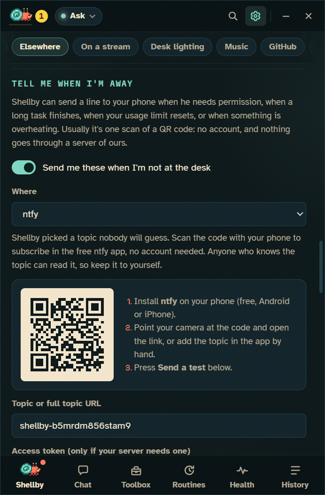

</td>
</tr>
</table>

- **👋 While you were away:** come back after an hour or more and a short recap is waiting above the box: what finished, what failed, what's waiting on you, and roughly how much of your 5-hour usage window each conversation took. Click a row to open that conversation. Turn it off under **Settings → System**.
- **🧳 Is it safe to leave?** One click in his menu checks the projects you've worked in lately for commits no remote has, uncommitted changes (in Shellby's copies too) and stashes, plus anything Claude is still working on or waiting for: *"2 projects have unpushed work."* **Lock the PC** checks first and locks straight away when it's all clear. A shutdown or sign-out with unpushed or uncommitted work, or with Claude mid-task, is held up with the reason and Windows' **Shut down anyway**. Turn that off under **Settings → System**.
- **📱 Tell me when I'm away:** a permission prompt, a finished run, a reset usage limit, a red build or an overheating GPU can reach your phone. **ntfy** is one QR scan with no account; **Telegram** finds your chat by itself; **Pushover**, a **Discord** or **Slack** webhook, or your own endpoint work too. Nothing goes through a server of ours, a four-second task doesn't buzz your pocket, and **Guard my focus** holds them back unless you say otherwise.
- **📲 Answer from your phone (optional):** with Telegram or ntfy, **Let me answer Allow or Deny from my phone** puts the two buttons on the notification. Each prompt gets its own single-use code that expires after 30 minutes. Only your private chat with the bot counts, and an ntfy topic has to be one nobody will guess. Questions, plans, **Always allow**, long commands, and anything the card would warn you about still wait for you at the desk.
- **🎥 On a stream:** **Settings → On a stream** serves him as an OBS browser source on a transparent background — the same crab, outfit and animations, reacting live in the corner. It's the critter's own stylesheet behind it, on 127.0.0.1 only.
- **💡 Desk lighting:** through [OpenRGB](https://openrgb.org), coral while he works, amber when he needs you, red when a build goes red or something overheats. **Install OpenRGB for me** does it with winget after you confirm, and he starts it in the tray whenever the lighting is on.
- **✅ CI on your pull requests:** sign in with GitHub and when a build goes red he holds up a ✗ sign, when it's fixed he dances, and a review request makes him raise a claw. **Ask Shellby why** reads the failing logs and explains them without changing anything.

## 🧭 Easy to get around

- **A bar along the bottom:** Shellby, Chat, Toolbox, Automate (workflows and routines), Health and History, labeled, with the current screen lit up.
- **<kbd>Ctrl</kbd>+<kbd>K</kbd> jumps anywhere:** any screen, Settings section, permission mode, past conversation or skill.
- **<kbd>Ctrl</kbd>+<kbd>1</kbd>–<kbd>6</kbd>** for the bar, <kbd>Esc</kbd> goes back up one level, and Settings is split into four tabs (Shellby, Claude, Connections, General), with <kbd>Ctrl</kbd>+<kbd>K</kbd> finding any setting wherever it lives.
- **Also:** <kbd>Ctrl</kbd>+<kbd>Alt</kbd>+<kbd>Space</kbd> opens him from anywhere, plus a live 5-hour and weekly usage meter (click it to see which tabs, routines and projects used it up), resumable history, a tray menu, notifications and [custom skins](docs/SKINS.md).
- **Updates are a button:** **Settings → About** shows what version he's on and whether a new one is waiting, with **Restart and update** when it has downloaded. The tray menu has the same button, and a dot on the ⚙ gear tells you from any screen.
- **Something wrong?** **Report a problem** in his right-click menu opens a GitHub issue with his version, your Windows build and the last lines of his log already filled in — your home folder shortened to `~` and anything token-shaped cut out — and nothing is sent until you press submit.
- **Kind to your battery:** he stops animating when you aren't looking, and everything stops while your screen is locked.

## 🔒 You stay in control

- **Permission cards:** **Allow**, **Always allow** or **Deny**, with <kbd>Y</kbd> / <kbd>A</kbd> / <kbd>N</kbd>. Claude's multiple-choice questions get cards too: press <kbd>1</kbd>–<kbd>9</kbd>, pick several, type your own answer, or **Skip**.
- **Self-built tooling gets flagged:** the card warns you when a command runs a script Claude wrote earlier in the conversation, or an edit touches Claude Code's own setup (skills, agents, hooks, settings, `CLAUDE.md`).
- **Five permission modes,** from Ask first to a fenced-off Autonomous. See [Permission modes](#permission-modes).
- **Your plan, your PC:** no API keys, no telemetry, and your history stays on your PC.

### GitHub sign-in (optional)

Sign in with a short code you approve on github.com, with no password typed into Shellby. GitHub is only asked for what the features you turn on need:

- **Sync between PCs:** trophies, collected items, XP, streak days, outfit and color, through a private gist. Syncing only ever adds progress.
- **Visiting crabs:** add friends by GitHub username and their crab drops by your desktop now and then, wearing their outfit, and leaves a souvenir in your guestbook. You can also invite them over or send a wave (a few fixed lines, so nobody can put words in your crab's mouth). It works through a small public "calling card" gist with your crab's look and level, and nothing else. Waves are comments on it, and only friends you added get through. Turning it off, or signing out, deletes the card. Its own switch, never turned on by a first sign-in.
- **Watch CI on your pull requests**, as above. Public repos need nothing beyond the sign-in; private ones need "Let Claude tasks push" too.
- **Publish your Wardrobe packs** to the community gallery: Shellby forks it and opens the pull request for you.
- **Let Claude tasks push:** Shellby's tabs get your sign-in for `git push`/`pull`, `gh` and the official GitHub plugin. Off by default, with a warning before it's turned on.
- **…including changes to CI workflows:** its own switch, off by default, because a workflow runs on GitHub's machines with your repository's secrets. It can't be granted by a first sign-in.

Your name and avatar show in Settings and on your crab card. The sign-in is encrypted by Windows and never stored in settings.json.

## Install

**Just the crab:** download **Shellby-Setup-x.y.z.exe** (or the portable build) from [Releases](https://github.com/x-salmon/shellby/releases/latest), run it, and pick **Just the crab**. That's it: Health, the Wardrobe, his voice, trophies and crab cards, no account. You can add Claude Code later from Settings.

**Crab + Claude Code:**

1. **Install Claude Code** and sign in with your Claude account (Pro or Max):
   ```powershell
   npm install -g @anthropic-ai/claude-code
   claude auth login
   ```
2. Download **Shellby-Setup-x.y.z.exe** (or the portable build) from [Releases](https://github.com/x-salmon/shellby/releases/latest) and run it.
3. Shellby walks you through a two-step check (CLI found ✓, signed in with a Claude account ✓) and asks how much freedom he gets.

> **"Windows protected your PC"?** That's Microsoft SmartScreen. It warns about any app that isn't code-signed or that few people have downloaded yet, and Shellby releases aren't signed yet.
>
> - **To install anyway:** click **More info → Run anyway**.
> - **To check you got the real file:** every release is built by [GitHub Actions](https://github.com/x-salmon/shellby/actions/workflows/release.yml) from the tagged commit, and each one lists SHA-256 checksums in `SHA256SUMS.txt`. Compare them with `Get-FileHash .\Shellby-Setup-x.y.z.exe`, or build from source (below).

**Updating:** the installed version updates itself. He checks GitHub Releases, downloads in the background, and puts a dot on the ⚙ gear when an update is ready. Click **Restart and update** in **Settings → About** or the tray menu, or just quit and it installs on the way out. Your settings live in `%APPDATA%\Shellby`, so they carry over. The portable build can't update itself: download the new `Shellby-Portable-x.y.z.exe` from [Releases](https://github.com/x-salmon/shellby/releases/latest) and replace the old one.

**Requirements:** Windows 10 or 11 (x64). For the Claude side: Claude Code 2.1+ and a Claude Pro or Max plan.

## How it works

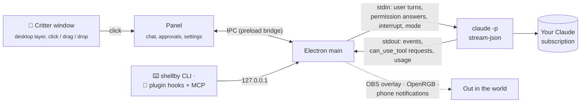

Shellby doesn't talk to any AI API itself. Each conversation is one long-lived Claude Code process:

```
claude -p --input-format stream-json --output-format stream-json --verbose
       --permission-prompt-tool stdio --permission-mode <mode> [--resume <id>]
```

<details>
<summary><b>Protocol details</b></summary>

- **Tasks** go in as JSON user messages on stdin. One process holds the whole conversation, so follow-ups keep context.
- **Permission prompts** come out as `control_request { subtype: "can_use_tool" }` and Shellby answers with `allow` / `deny` (plus the suggested rules for "Always allow"). This is the same host protocol the Claude Agent SDK uses.
- **Stop** sends an `interrupt` control request, and falls back to killing the process tree if the CLI doesn't wind down.
- **Mode changes** mid-conversation send `set_permission_mode`.
- **Subagents** come through as `task_started` / `task_progress` / `task_notification` system events. Their messages carry `parent_tool_use_id`, the Agent call that spawned them, and their permission prompts carry `agent_id`, which equals the `task_id`. That's all it takes to route every event, prompt and helper crab to the right lane.
- **The toolbox** merges the skills, agents, commands and MCP servers reported in Claude Code's `init` event with a scan of `~/.claude` and the project's `.claude/`. A file watcher on those folders is how Shellby notices new tricks.
- **Billing safety:** Shellby never sees your Claude sign-in. You log in to the official, unmodified Claude Code CLI yourself, and Shellby only reads `claude auth status` to show which account and plan it's on. Claude Code gets the environment as it is on your PC, so if `ANTHROPIC_API_KEY`, `ANTHROPIC_AUTH_TOKEN`, `ANTHROPIC_BASE_URL` or a Bedrock/Vertex/Foundry switch is set, Settings warns that it may bill that instead. **Always use my Claude plan** leaves them all out. Usage counts against your plan's normal limits, exactly as if you'd typed the task into a terminal.

**Staying on the desktop layer:** the critter window is made an *owned window* of the shell's desktop host (the `Progman`/`WorkerW` window that contains `SHELLDLL_DefView`), via [koffi](https://koffi.dev) FFI calls into `user32.dll`. Owned windows share their owner's z-order band, so he sits above your wallpaper and icons and below every app. A `TaskbarCreated` hook re-pins him when Explorer restarts, and a slow watchdog covers anything else.

</details>

## Permission modes

| Mode | Reads | Edits files | Runs commands | Notes |
|---|---|---|---|---|
| **Ask first** *(default)* | ✅ | asks | asks | Recommended. |
| **Smart** | ✅ | auto* | auto* | Claude Code's `auto` mode: a safety classifier approves routine steps and blocks risky ones. |
| **Auto-edit** | ✅ | ✅ | asks | |
| **Plan only** | ✅ | ✗ | ✗ | Shellby proposes a plan card, and nothing changes until you approve. |
| **Autonomous** | ✅ | ✅ | ✅ | `bypassPermissions`. Behind an explicit warning, never the default, and never reachable from the `shellby` command. |

Your own Claude Code allow/deny rules in `~/.claude/settings.json` still apply in every mode.

## Build from source

`git clone`, `npm install`, `npm start`. The full setup, every test and maintenance script, and a map of the code are in [docs/DEVELOPMENT.md](docs/DEVELOPMENT.md). Every image in this README is rendered from the real app: `npm run screenshots`, `npm run reel` and `python scripts/make-banners.py`.

## Privacy

Everything stays on your PC. Conversation history lives in `%APPDATA%\Shellby\sessions`, and Shellby has no telemetry and no servers. The only network traffic is:

- Claude Code talking to Anthropic, and the updater checking GitHub Releases.
- Community pack downloads you ask for.
- GitHub, only if you sign in: your profile, the sync gist, pack pull requests, the CI status of your open pull requests, and with Visiting crabs on, your public calling card and your friends' cards.
- Phone notifications, only if you turn them on, straight to the service you picked (ntfy, Pushover, Telegram, Discord, Slack or your own endpoint).
- Things that never leave your PC: the time tracker (it reads the title of the window in front to tell which project you're in, keeps only the project, the day and the minutes, and never syncs them), push-to-talk audio (Windows' offline speech recognizer hears it, and the microphone is only open while you hold the shortcut), LibreHardwareMonitor or HWiNFO sensor readings, OpenRGB, the OBS overlay, and the port the `shellby` command and the plugin use — all on `127.0.0.1`.

See [SECURITY.md](SECURITY.md) for the renderer sandboxing details.

## Contributing

Skins, packs, bug reports and PRs are welcome. See [CONTRIBUTING.md](CONTRIBUTING.md).

## License

Shellby is free software under the [GPL-3.0](LICENSE). Read him, change him, share him, build on him. The one condition: if you hand out a changed version, it stays open under the same licence, so fixes find their way back to everyone instead of disappearing into a closed-source app.

The name **Shellby** and the crab as a mascot aren't part of that licence. Fork the code all you want — just give your crab its own name, so nobody downloads yours thinking it's this one. [TRADEMARK.md](TRADEMARK.md) spells out what's reserved and what's fair game.

Copyright stays with x-salmon, so there may one day be paid extras alongside the free crab. The app in this repository stays GPL-3.0 and free.

## Disclaimer

Shellby is an independent open-source project. It is **not affiliated with, endorsed by, or sponsored by Anthropic**. "Claude" and "Claude Code" are trademarks of Anthropic, PBC. Shellby only automates the official Claude Code CLI you install and sign in to yourself, and your use of it is subject to [Anthropic's terms](https://www.anthropic.com/legal/consumer-terms).

Shellby acts on your real files with your real permissions. Read what you approve, and keep backups.

<sub>GPL-3.0 licensed, see [LICENSE](LICENSE) and [TRADEMARK.md](TRADEMARK.md). The bundled fonts, Pixelify Sans, Atkinson Hyperlegible and Martian Mono, are under the SIL Open Font License 1.1 (see [assets/fonts](assets/fonts)).</sub>
