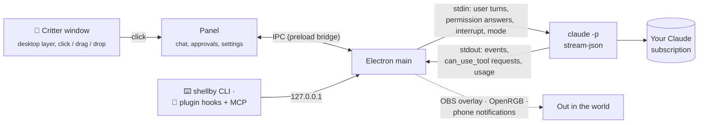

<div align="center">


[](https://github.com/x-salmon/shellby/releases/latest)  [](https://github.com/x-salmon/shellby/releases) [](LICENSE)

Give him a task and he scuttles off, sends out helper crabs and builds his own tools,<br>
all on **your own Claude Pro or Max plan**. No API keys, no per-token billing.<br>
No Claude? He's still a desk pet who talks, watches your PC, dresses up and earns trophies.

### [⬇ Download for Windows](https://github.com/x-salmon/shellby/releases/latest)

[What's new](#whats-new) · [Community packs](https://x-salmon.github.io/shellby-packs/) · [How it works](#how-it-works) · [Skins](docs/SKINS.md) · [Security](SECURITY.md) · [Changelog](CHANGELOG.md)

<br>


<sub>Give him a task, watch the helper crabs go, earn outfits. ([MP4 version](docs/shellby-demo.mp4))</sub>

</div>

---

## Get started

1. **[Download the installer](https://github.com/x-salmon/shellby/releases/latest)** (`Shellby-Setup-x.y.z.exe`) and run it on Windows 10 or 11.
2. Pick **Just the crab** (no account needed) or **Crab + Claude Code** (uses your Claude Pro or Max plan).
3. He moves onto your desktop. Click him to open the panel.

Windows may show a SmartScreen warning the first time; [Install](#install) explains it, along with the Claude Code setup.

## What's new

<table>
<tr>
<td width="33%" valign="top">

**🗣️ He has a voice** · 0.18<br>
<sub>A few words of his own about the work he's actually doing: *"fingers crossed"* at a test run, *"this file again?"* on the third visit. Four temperaments, Quiet to Chatty.</sub>

</td>
<td width="33%" valign="top">

**🐚 Shellby's own life** · 0.17<br>
<sub>He grows into new shells as he levels, molting on your desktop. Pet him, throw him, and let him guard your focus in a helmet.</sub>

</td>
<td width="33%" valign="top">

**⌨️ A `shellby` command** · 0.20<br>
<sub><code>shellby do "tidy my Downloads"</code> from any terminal, and an MCP server so Claude can talk through him on purpose.</sub>

</td>
</tr>
<tr>
<td valign="top">

**📱 Your phone, in one scan** · 0.21<br>
<sub>A permission prompt, a finished run or a red build can reach your phone. ntfy is one QR code; Telegram finds your chat by itself.</sub>

</td>
<td valign="top">

**🎧 He listens along** · 0.20<br>
<sub>Spotify, a browser tab, anything in the volume flyout: he puts his headphones on and has the odd word about it.</sub>

</td>
<td valign="top">

**🎥 On stream, 💡 on your desk** · 0.20<br>
<sub>An OBS browser source with a transparent background, and OpenRGB lighting that follows his mood. Shellby installs OpenRGB for you.</sub>

</td>
</tr>
<tr>
<td valign="top">

**🦀 Eleven more packs** · 0.20<br>
<sub>Head-to-tail sets, crabs that aren't the classic shape, and the quiet seasons filled in. 105 accessories, 18 effects, 16 crabs.</sub>

</td>
<td valign="top">

**🛡️ A security read** · 0.20<br>
<sub>The shield next to a project sends your unpushed work for a read-only review, worst first. He changes nothing.</sub>

</td>
<td valign="top">

**🔄 Updating is a button** · 0.19<br>
<sub><b>Restart and update</b> in Settings and the tray, <b>Report a problem</b> with the facts filled in, and kinder to your battery.</sub>

</td>
</tr>
</table>

## 🦀 He lives on your desktop

<p align="center"></p>

- **On the wallpaper layer:** behind every window, and still there after <kbd>Win</kbd>+<kbd>D</kbd>.
- **Shows you what's happening:** he scuttles while Claude works, raises a claw when it needs you, celebrates when it's done and naps when it's quiet.
- **He has a voice:** a few words of his own in his bubble, about the work he's actually doing — *"fingers crossed"* at a test run, *"all green!"* when it passes, *"shipped it"* after a push, *"this file again?"* on the third visit. He says good morning, notices when you've been away, and mutters to himself when it's quiet. He never quotes Claude; the lines are all his.
- **A temperament of his own:** chipper, fussy, cocky or sleepy, picked once from your install and kept. It adds lines (a cocky crab says *"obviously"*) and colours his idle habits: digging at your wallpaper, buffing his shell, peeking at what you're doing, stretching, flopping over.
- **Pet him** by rubbing the mouse back and forth over him. **Flick him** while dragging and he tumbles across the screen and lands on the taskbar. When he's idle he strolls around his spot a little.
- **He guards your focus:** right-click him → **Guard my focus** (15, 25 or 50 minutes). He puts on a helmet, counts down, holds back the notifications that can wait, and takes a break with you when time's up.
- **He listens along:** when something's playing he puts his headphones on, with the odd *"good one"*. Read from Windows itself, so there's no account and nothing leaves your PC.
- **Drop files on him** to hand them to a task, or **paste a screenshot** (Win+Shift+S, then Ctrl+V) straight into the box: Claude sees the picture itself. **Wandered off-screen?** **Settings → Look → Find Shellby** brings him back.

<details>
<summary><b>How much he talks, and when he doesn't</b></summary>

- **Settings → Look → Personality:** **Quiet** is a single mark in the bubble and never a word. **Normal** (the default) leaves at least 40 seconds between lines. **Chatty** shortens that to 12 seconds and lets him mutter when nothing's happening.
- He never speaks while guarding your focus, never repeats a line while another one is unused, and anything that matters — a health warning, a red build, a countdown — takes the bubble back off him.
- **A chirp when he speaks,** synthesized on the spot rather than shipped as audio. Off by default, under **Settings → Look**.
- **Usage limit reached?** He naps with a countdown to the reset, then wakes up and taps you the moment your 5-hour or weekly limit resets, even if your PC was asleep.

</details>

## 🎩 Dress him up

<p align="center"></p>

- **105 accessories, 18 effects and 16 crabs** for his hat, face, neck, claw and shell. They move with him: a pumpkin swings with his claw, and eyewear scans along while he reads.
- **Head-to-tail sets:** a dev desk with a rubber duck, a tide pool he'd actually come from, and an on-call kit with a pager and an extinguisher. Each covers every slot.
- **He grows into new shells:** level 3 brings a Snail Shell, then a Tin Can, a Teacup, a Toy Brick and the Golden Conch at level 20. Each is a little molt on your desktop: out of the old shell, a shiver, into the new one. Pick any home you've grown into under **Outfits → Homes**.
- **Seasons:** he dresses up for Halloween, winter, Valentine's, spring, summer and autumn, and seasonal items are yours to keep if you're around while the season is on.
- **26 trophies**, a few of them secret, unlock outfits as you use him: the rubber duck arrives when you let him run a script he wrote, the barnacles after seven days together. Or flip **Unlock everything**.
- **XP and levels,** from Hatchling to Legend of the Tides. Writing himself a new skill earns the most.
- **Outfit codes** like `SHB-B1T7-2DB1-7MXH-JW90` share a look, and a **📸 crab card** shows him off.

<p align="center"></p>

<table>
<tr>
<td width="50%"></td>
<td width="50%"></td>
</tr>
</table>

<details>
<summary><b>XP, trophies, streaks and outfit codes in detail</b></summary>

- **XP sources:** a new skill or agent he writes for himself (+150, usually a level-up), deploys (+50), pushes (+40), passing tests (+25), trophies (+20), focus sessions (+15) and finished tasks (+10). It counts in Shellby and, with the plugin, in your terminal too. "+25 XP" floats up from him on the desktop, and hourly caps stop a test loop from farming it. Level-ups get their own celebration.
- **Trophies & XP:** click the yellow level badge next to him in the title bar to see his level, an XP log and your streak.
- **Trophy examples:** finish 10 tasks for a hard hat, send out your first helper for a captain's hat, finish a task after midnight for a nightcap, free up a full drive for a broom. Trophies hand out two or three things each, and unlocks celebrate on your desktop with confetti.
- **Streaks and nudges:** finish a Claude task on consecutive days for a 🔥 streak (it's in the status line too). Shellby remembers the git repos you work in, and when one goes quiet you get a nudge: *"You haven't committed to 3d-rack in 5 days 🐚"*. **Pick it up** opens a tab there with a "where did we leave off?" prompt. At most one nudge a day, only in the daytime, and each project can be muted.
- **Helper crabs wear matching hats,** and every crab in the app is dressed the same way.
- **Outfit codes:** paste someone's code into **Wear a code…** and Shellby previews it on your crab, then puts it on. Locked items show which trophy unlocks them, and items from packs you don't have come with a **Get pack** button. Codes are typo-proof and need no server.
- **Crab card:** **📸 Share** on Shellby's screen makes a card with Shellby as he's dressed, your best trophy, task count and trophy shelf. It's copied to your clipboard and saved to `Pictures\Shellby`. Sharing one earns a trophy too.

<p align="center"></p>

</details>

### Community wardrobe

<a href="https://x-salmon.github.io/shellby-packs/"></a>

More hats, effects and colors from other people at **[x-salmon.github.io/shellby-packs](https://x-salmon.github.io/shellby-packs/)**.

- **Install in one click:** every item is previewed on a live Shellby, and the app shows exactly what a pack contains before it installs.
- **Safe by design:** packs are pixel art and settings in JSON, so they can't run code, and each download is checked against the gallery's SHA-256.
- **Make your own** in [Pack Studio](https://x-salmon.github.io/shellby-packs/studio.html), then publish it from the app (Shellby forks the gallery and opens the pull request) or by hand on [x-salmon/shellby-packs](https://github.com/x-salmon/shellby-packs). The format is in [docs/ADDONS.md](docs/ADDONS.md) ([JSON Schema](docs/addon.schema.json)).

## 🩺 He watches your PC

<p align="center">
  
</p>

- **Live vitals:** GPU and CPU temperature and load, memory, and every drive, with 10-minute sparklines. NVIDIA, AMD and Intel cards all get their load, memory, power and fan gauges.
- **Drive temperatures, case fans and the battery** too, and a drive cooking itself gets its own warning — an NVMe throttles around 75°C and nothing else tells you.
- **What Docker, WSL and the package caches are sitting on.** On a developer's PC these are usually the biggest things on the drive. He says when there are tens of gigabytes to reclaim, and **Ask Shellby** comes back with what's safe to clear and the exact command. He never prunes or deletes anything himself.
- **His mood follows your hardware:** he sweats past 80°C, gets dizzy when memory fills up, and overstuffs his shell when a drive is full. One notification per problem, and another when it's fixed. You set the thresholds.
- **"Ask Shellby why"** runs a read-only Claude task that finds the cause and reports back.
- **What's hogging it.** While he sweats or sees stars, the busiest processes are listed right under the warning, sorted by GPU, CPU or memory, each with an **End task** that asks first.
- **What starts with Windows.** Everything that launches when you sign in, and a read-only **Ask Shellby** report on which ones you actually need.

<p align="center"></p>

<details>
<summary><b>How Health works</b></summary>

- Everything is read locally, with no admin rights needed. NVIDIA GPUs work out of the box through `nvidia-smi`.
- **CPU temperature and the rest** come from [LibreHardwareMonitor](https://github.com/LibreHardwareMonitor/LibreHardwareMonitor)'s local web server, because Windows won't give them to normal apps. **HWiNFO** works too, through its Remote Sensor Monitor. The Health view walks you through the setup.
- Readings must stay over the line for about 20 seconds, so a loading-screen spike doesn't count. Past 88°C he pants under a heat shimmer, and it wakes him up if he's asleep.
- "Ask Shellby why" never deletes or kills anything. The only thing Health can end is a process you pick, after you confirm it, and never Windows' own. You can also turn the desktop reactions off and keep only the dashboard.
- More in [docs/HEALTH.md](docs/HEALTH.md).

</details>

## ⚡ He gets things done with Claude Code

<table>
<tr>
<td width="50%"></td>
<td width="50%"></td>
</tr>
<tr>
<td align="center"><sub>Helpers work in parallel, each in its own lane</sub></td>
<td align="center"><sub>Skills and agents he builds show up in his Toolbox</sub></td>
</tr>
</table>

- **Helper crabs:** each subagent gets its own lane in the panel and its own crab on your desktop.
- **Parallel tabs,** each its own Claude Code process. Keep typing while he works and your messages queue up. Drag tabs into the order you like, and they come back that way.
- **See what every turn changed:** in a git project, each turn ends with a **± files changed** block. Open a file for its diff, or press **Undo** twice to put the files back the way they were before that turn. It catches everything, including what a script or `npm install` did, and it never touches your staging area. Undo refuses if a file has changed again since, so it can't eat later work.
- **A copy of the project for each tab (optional):** **Settings → Working folder → Give each new conversation its own copy** puts each new tab in a git worktree on its own branch, so two tabs in one repo stop stepping on each other. The branch shows next to the folder; **Bring it home** commits what's left, merges it into the branch it came from and tidies the copy away. If the merge would clash, nothing is merged, and he can sort it out on his own branch.
- **Toolbox:** every skill, agent, command and MCP server Claude Code can use, plus the hooks and `CLAUDE.md` memory files that set it up, with an editor for each. When he writes himself a new tool, he celebrates.
- **Skill Shop** installs plugins from Claude Code's marketplaces, asking first every time.
- **Routines** run tasks on a schedule, like "every Friday at 5, tidy Downloads".
- **Look over my changes:** the shield next to a project in **Trophies** sends the work you haven't pushed yet for a read-only security read. He reports what looks risky, worst first, and changes nothing — and he won't tell you you're secure.
- **Chats you can tick off:** a ✓ on every row in History marks a conversation done, so the twenty you've finished with stop burying the two you haven't. Nothing is deleted, and sending it something new un-ticks it.
- **Works everywhere you use Claude Code:** with the plugin he reacts to your terminal and editor sessions too — *"shellby in Cursor"*, VS Code, Windsurf, Zed, JetBrains, Windows Terminal — and shows up in Claude Code's status line.

<details>
<summary><b>The details</b></summary>

- **The plugin:** one click in **Settings → Claude Code everywhere**, or `/plugin marketplace add x-salmon/shellby` then `/plugin install shellby@shellby` in Claude Code. He scuttles while Claude works, raises a claw when it needs permission, celebrates finished turns and sends out helper crabs for subagents. See [claude-plugin/](claude-plugin/).
- **Crew view:** each helper's lane shows its task, live activity, tool count, tokens and time. Click a helper crab on the desktop to jump to its conversation. When a helper needs permission, the card shows up in its lane, labelled with which crab is asking.
- **Status line:** `🦀💨 Shellby working · Lv 5 Claw Coder ▰▰▰▱▱ · 🥵 GPU 84°C · +25 XP`, right under the prompt in the terminal and VS Code. Turn it on in **Settings → Claude Code everywhere → Status line** (it asks first, keeps a backup, and restores your old status line if you remove it), or run `/shellby:statusline`. In the classic cmd.exe console, which can't draw emoji, it switches to a plain-text line.
- **Queue:** Enter queues a message while he's busy, and it's sent when the current turn finishes. Click a queued message (or press <kbd>↑</kbd>) to edit it. Stopping hands the queue back to you instead of firing it.
- **Tabs:** build a tool in one tab while you use it in another. <kbd>Ctrl</kbd>+<kbd>T</kbd>, <kbd>Ctrl</kbd>+<kbd>W</kbd> and <kbd>Ctrl</kbd>+<kbd>Tab</kbd> work like a browser, and so does dragging one along the strip. <kbd>Ctrl</kbd>+<kbd>Shift</kbd>+<kbd>PageUp</kbd>/<kbd>PageDown</kbd> moves one without the mouse.
- **Toolbox:** MCP servers show their connection status. New skills and agents are tagged **new** and can be pinned as one-click chips on the start screen, and <kbd>/</kbd> in the composer autocompletes all of them.
- **Hooks and memory:** **Toolbox → Hooks** lists every hook in your settings, the project's and your installed plugins', and adds, edits or removes your own. Each change asks first in the isolated confirmation window, shows the exact command and keeps a backup of the settings file. **Toolbox → Memory** opens your `CLAUDE.md`, the project's, `CLAUDE.local.md`, `.claude/rules/` and any `CLAUDE.md` in the folders above, in an editor that won't save over a change made somewhere else.
- **Skill Shop:** **Toolbox → Get more** lists every plugin in your marketplaces, most popular first. Add marketplaces from GitHub, and every install asks first in an isolated confirmation window. It uses Claude Code's own plugin system, so whatever you install works in your terminal and editor too.
- **Routines:** each run opens its own tab with its own permission mode, and missed runs catch up when your PC wakes up.
- **Claude Code somewhere unusual?** **Find it myself…** in setup takes a portable copy or another drive, and checks the file really is Claude Code before keeping it.

</details>

## 🌊 He gets out more

<table>
<tr>
<td width="50%" valign="top">

### ⌨️ From any terminal

```powershell
shellby do "tidy my Downloads"   # a task, in this folder
shellby say "all green"          # a line in his bubble
shellby status                   # him, and how this PC is doing
```

**Settings → Claude Code everywhere → the shellby command** puts it on your PATH, appended so it can't shadow anything, and removing it restores your PATH exactly. Starting a task needs a token only Shellby's own folder holds, and **Autonomous isn't reachable from a terminal at all.**

### 🤖 Claude can drive him

The plugin brings an MCP server with four tools — `say`, `celebrate`, `wear` and `status` — so a skill can have him say what it's up to, celebrate when a release actually lands, or check the GPU before kicking off something heavy. **It cannot start tasks**: spending your subscription isn't something a local port gets to do.

</td>
<td width="50%" valign="top">


</td>
</tr>
</table>

- **👋 While you were away:** come back after an hour or more and a short recap is waiting above the box: what finished, what failed, what's waiting on you, and roughly how much of your 5-hour usage window each conversation took. Click a row to open that conversation. Turn it off under **Settings → System**.
- **📱 Tell me when I'm away:** a permission prompt, a finished run, a reset usage limit, a red build or an overheating GPU can reach your phone. **ntfy** is one QR scan with no account; **Telegram** finds your chat by itself; **Pushover**, a **Discord** or **Slack** webhook, or your own endpoint work too. Nothing goes through a server of ours, a four-second task doesn't buzz your pocket, and **Guard my focus** holds them back unless you say otherwise.
- **📲 Answer from your phone (optional):** with Telegram or ntfy, **Let me answer Allow or Deny from my phone** puts the two buttons on the notification. Each prompt gets its own single-use code that expires after 30 minutes. Only your private chat with the bot counts, and an ntfy topic has to be one nobody will guess. Questions, plans, **Always allow**, long commands, and anything the card would warn you about still wait for you at the desk.
- **🎥 On a stream:** **Settings → On a stream** serves him as an OBS browser source on a transparent background — the same crab, outfit and animations, reacting live in the corner. It's the critter's own stylesheet behind it, on 127.0.0.1 only.
- **💡 Desk lighting:** through [OpenRGB](https://openrgb.org), coral while he works, amber when he needs you, red when a build goes red or something overheats. **Install OpenRGB for me** does it with winget after you confirm, and he starts it in the tray whenever the lighting is on.
- **✅ CI on your pull requests:** sign in with GitHub and when a build goes red he holds up a ✗ sign, when it's fixed he dances, and a review request makes him raise a claw. **Ask Shellby why** reads the failing logs and explains them without changing anything.

## 🧭 Easy to get around

- **A bar along the bottom:** Shellby, Chat, Toolbox, Routines, Health and History, labeled, with the current screen lit up.
- **<kbd>Ctrl</kbd>+<kbd>K</kbd> jumps anywhere:** any screen, Settings section, permission mode, past conversation or skill.
- **<kbd>Ctrl</kbd>+<kbd>1</kbd>–<kbd>6</kbd>** for the bar, <kbd>Esc</kbd> goes back up one level, and Settings has section links that stay on screen as you scroll.
- **Also:** <kbd>Ctrl</kbd>+<kbd>Alt</kbd>+<kbd>Space</kbd> opens him from anywhere, plus a live 5-hour and weekly usage meter (click it to see which tabs, routines and projects used it up), resumable history, a tray menu, notifications and [custom skins](docs/SKINS.md).
- **Updates are a button:** **Settings → About** shows what version he's on and whether a new one is waiting, with **Restart and update** when it has downloaded. The tray menu has the same button, and a dot on the ⚙ gear tells you from any screen.
- **Something wrong?** **Report a problem** in his right-click menu opens a GitHub issue with his version, your Windows build and the last lines of his log already filled in — your home folder shortened to `~` and anything token-shaped cut out — and nothing is sent until you press submit.
- **Kind to your battery:** he stops animating when you aren't looking, and everything stops while your screen is locked.

## 🔒 You stay in control

- **Permission cards:** **Allow**, **Always allow** or **Deny**, with <kbd>Y</kbd> / <kbd>A</kbd> / <kbd>N</kbd>. Claude's multiple-choice questions get cards too: press <kbd>1</kbd>–<kbd>9</kbd>, pick several, type your own answer, or **Skip**.
- **Self-built tooling gets flagged:** the card warns you when a command runs a script Claude wrote earlier in the conversation, or an edit touches Claude Code's own setup (skills, agents, hooks, settings, `CLAUDE.md`).
- **Five permission modes,** from Ask first to a fenced-off Autonomous. See [Permission modes](#permission-modes).
- **Your plan, your PC:** no API keys, no telemetry, and your history stays on your PC.

### GitHub sign-in (optional)

Sign in with a short code you approve on github.com, with no password typed into Shellby. GitHub is only asked for what the features you turn on need:

- **Sync between PCs:** trophies, collected items, XP, streak days, outfit and color, through a private gist. Syncing only ever adds progress.
- **Watch CI on your pull requests**, as above. Public repos need nothing beyond the sign-in; private ones need "Let Claude tasks push" too.
- **Publish your Wardrobe packs** to the community gallery: Shellby forks it and opens the pull request for you.
- **Let Claude tasks push:** Shellby's tabs get your sign-in for `git push`/`pull`, `gh` and the official GitHub plugin. Off by default, with a warning before it's turned on.
- **…including changes to CI workflows:** its own switch, off by default, because a workflow runs on GitHub's machines with your repository's secrets. It can't be granted by a first sign-in.

Your name and avatar show in Settings and on your crab card. The sign-in is encrypted by Windows and never stored in settings.json.

## Install

**Just the crab:** download **Shellby-Setup-x.y.z.exe** (or the portable build) from [Releases](https://github.com/x-salmon/shellby/releases/latest), run it, and pick **Just the crab**. That's it: Health, the Wardrobe, his voice, trophies and crab cards, no account. You can add Claude Code later from Settings.

**Crab + Claude Code:**

1. **Install Claude Code** and sign in with your Claude account (Pro or Max):
   ```powershell
   npm install -g @anthropic-ai/claude-code
   claude auth login
   ```
2. Download **Shellby-Setup-x.y.z.exe** (or the portable build) from [Releases](https://github.com/x-salmon/shellby/releases/latest) and run it.
3. Shellby walks you through a two-step check (CLI found ✓, signed in with a Claude account ✓) and asks how much freedom he gets.

> **"Windows protected your PC"?** That's Microsoft SmartScreen. It warns about any app that isn't code-signed or that few people have downloaded yet, and Shellby releases aren't signed yet.
>
> - **To install anyway:** click **More info → Run anyway**.
> - **To check you got the real file:** every release is built by [GitHub Actions](https://github.com/x-salmon/shellby/actions/workflows/release.yml) from the tagged commit, and each one lists SHA-256 checksums in `SHA256SUMS.txt`. Compare them with `Get-FileHash .\Shellby-Setup-x.y.z.exe`, or build from source (below).

**Updating:** the installed version updates itself. He checks GitHub Releases, downloads in the background, and puts a dot on the ⚙ gear when an update is ready. Click **Restart and update** in **Settings → About** or the tray menu, or just quit and it installs on the way out. Your settings live in `%APPDATA%\Shellby`, so they carry over. The portable build can't update itself: download the new `Shellby-Portable-x.y.z.exe` from [Releases](https://github.com/x-salmon/shellby/releases/latest) and replace the old one.

**Requirements:** Windows 10 or 11 (x64). For the Claude side: Claude Code 2.1+ and a Claude Pro or Max plan.

## How it works



Shellby doesn't talk to any AI API itself. Each conversation is one long-lived Claude Code process:

```
claude -p --input-format stream-json --output-format stream-json --verbose
       --permission-prompt-tool stdio --permission-mode <mode> [--resume <id>]
```

<details>
<summary><b>Protocol details</b></summary>

- **Tasks** go in as JSON user messages on stdin. One process holds the whole conversation, so follow-ups keep context.
- **Permission prompts** come out as `control_request { subtype: "can_use_tool" }` and Shellby answers with `allow` / `deny` (plus the suggested rules for "Always allow"). This is the same host protocol the Claude Agent SDK uses.
- **Stop** sends an `interrupt` control request, and falls back to killing the process tree if the CLI doesn't wind down.
- **Mode changes** mid-conversation send `set_permission_mode`.
- **Subagents** come through as `task_started` / `task_progress` / `task_notification` system events. Their messages carry `parent_tool_use_id`, the Agent call that spawned them, and their permission prompts carry `agent_id`, which equals the `task_id`. That's all it takes to route every event, prompt and helper crab to the right lane.
- **The toolbox** merges the skills, agents, commands and MCP servers reported in Claude Code's `init` event with a scan of `~/.claude` and the project's `.claude/`. A file watcher on those folders is how Shellby notices new tricks.
- **Billing safety:** before spawning the CLI, Shellby strips `ANTHROPIC_API_KEY`, `ANTHROPIC_AUTH_TOKEN`, `ANTHROPIC_BASE_URL` and the Bedrock/Vertex/Foundry switches from its environment, and onboarding checks `claude auth status` for a `claude.ai` login. Usage counts against your plan's normal limits, exactly as if you'd typed the task into a terminal.

**Staying on the desktop layer:** the critter window is made an *owned window* of the shell's desktop host (the `Progman`/`WorkerW` window that contains `SHELLDLL_DefView`), via [koffi](https://koffi.dev) FFI calls into `user32.dll`. Owned windows share their owner's z-order band, so he sits above your wallpaper and icons and below every app. A `TaskbarCreated` hook re-pins him when Explorer restarts, and a slow watchdog covers anything else.

</details>

## Permission modes

| Mode | Reads | Edits files | Runs commands | Notes |
|---|---|---|---|---|
| **Ask first** *(default)* | ✅ | asks | asks | Recommended. |
| **Smart** | ✅ | auto* | auto* | Claude Code's `auto` mode: a safety classifier approves routine steps and blocks risky ones. |
| **Auto-edit** | ✅ | ✅ | asks | |
| **Plan only** | ✅ | ✗ | ✗ | Shellby proposes a plan card, and nothing changes until you approve. |
| **Autonomous** | ✅ | ✅ | ✅ | `bypassPermissions`. Behind an explicit warning, never the default, and never reachable from the `shellby` command. |

Your own Claude Code allow/deny rules in `~/.claude/settings.json` still apply in every mode.

## Build from source

`git clone`, `npm install`, `npm start`. The full setup, every test and maintenance script, and a map of the code are in [docs/DEVELOPMENT.md](docs/DEVELOPMENT.md). Every image in this README is rendered from the real app: `npm run screenshots`, `npm run reel` and `python scripts/make-banners.py`.

## Privacy

Everything stays on your PC. Conversation history lives in `%APPDATA%\Shellby\sessions`, and Shellby has no telemetry and no servers. The only network traffic is:

- Claude Code talking to Anthropic, and the updater checking GitHub Releases.
- Community pack downloads you ask for.
- GitHub, only if you sign in: your profile, the sync gist, pack pull requests, the CI status of your open pull requests.
- Phone notifications, only if you turn them on, straight to the service you picked (ntfy, Pushover, Telegram, Discord, Slack or your own endpoint).
- Things that never leave your PC: LibreHardwareMonitor or HWiNFO sensor readings, OpenRGB, the OBS overlay, and the port the `shellby` command and the plugin use — all on `127.0.0.1`.

See [SECURITY.md](SECURITY.md) for the renderer sandboxing details.

## Contributing

Skins, packs, bug reports and PRs are welcome. See [CONTRIBUTING.md](CONTRIBUTING.md).

## License

Shellby is free software under the [GPL-3.0](LICENSE). Read him, change him, share him, build on him. The one condition: if you hand out a changed version, it stays open under the same licence, so fixes find their way back to everyone instead of disappearing into a closed-source app.

The name **Shellby** and the crab as a mascot aren't part of that licence. Fork the code all you want — just give your crab its own name, so nobody downloads yours thinking it's this one. [TRADEMARK.md](TRADEMARK.md) spells out what's reserved and what's fair game.

Copyright stays with x-salmon, so there may one day be paid extras alongside the free crab. The app in this repository stays GPL-3.0 and free.

## Disclaimer

Shellby is an independent open-source project. It is **not affiliated with, endorsed by, or sponsored by Anthropic**. "Claude" and "Claude Code" are trademarks of Anthropic, PBC. Shellby only automates the official Claude Code CLI you install and sign in to yourself, and your use of it is subject to [Anthropic's terms](https://www.anthropic.com/legal/consumer-terms).

Shellby acts on your real files with your real permissions. Read what you approve, and keep backups.

<sub>GPL-3.0 licensed, see [LICENSE](LICENSE) and [TRADEMARK.md](TRADEMARK.md). The bundled fonts, Pixelify Sans, Atkinson Hyperlegible and Martian Mono, are under the SIL Open Font License 1.1 (see [assets/fonts](assets/fonts)).</sub>
