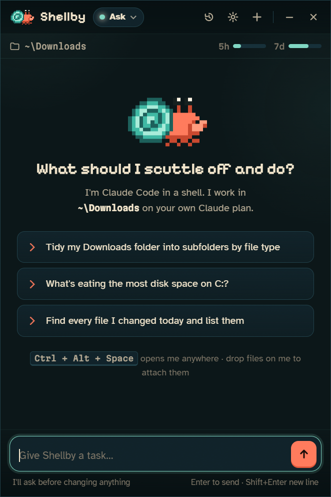
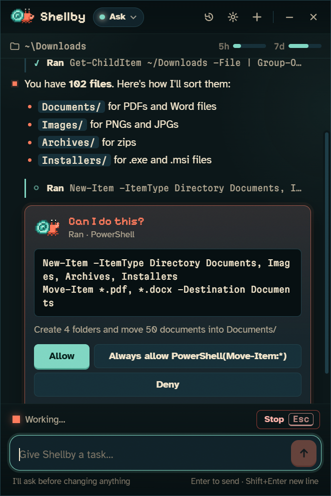
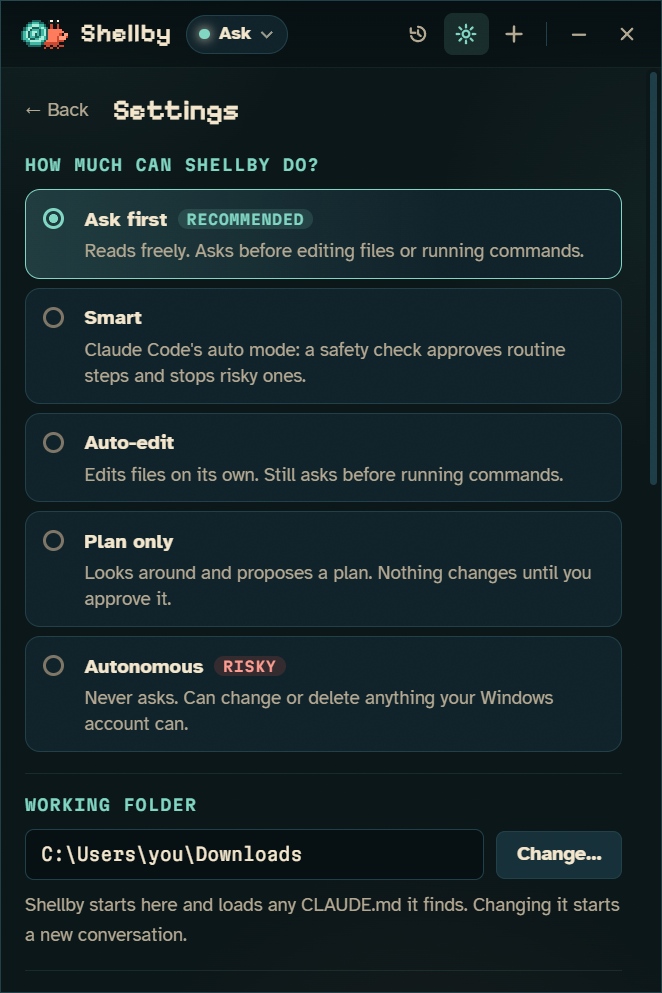
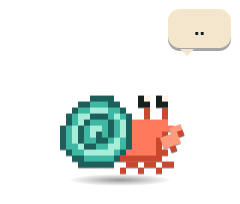
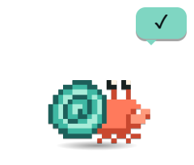
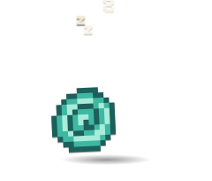
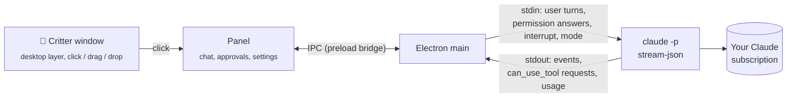

<div align="center">


# Shellby

**A pixel hermit crab that lives on your Windows desktop and gets things done with Claude Code.**

Click him, type a task ("tidy my Downloads", "what's eating my disk?"), and watch him scuttle.<br>
He runs on **your own Claude Pro/Max subscription**. No API keys, no per-token billing.

[Download](https://github.com/Sandoxus/shellby/releases/latest) · [How it works](#how-it-works) · [Skins](docs/SKINS.md) · [Security](SECURITY.md)

</div>

---

<table>
<tr>
<td width="33%"></td>
<td width="33%"></td>
<td width="33%"></td>
</tr>
<tr>
<td align="center"><sub>Give him a task</sub></td>
<td align="center"><sub>He asks before touching anything</sub></td>
<td align="center"><sub>You decide how much he can do</sub></td>
</tr>
</table>

## What it does

- **Lives on your desktop, not over your apps.** Shellby sits on the wallpaper layer, behind every window, and stays put through <kbd>Win</kbd>+<kbd>D</kbd>. He idles, blinks, scuttles while working, holds up a sign when he needs you, and naps in his shell when ignored.
- **Real Claude Code underneath.** Every task runs through the official `claude` CLI, so he gets Claude Code's full toolset (files, shell, search, web), your `CLAUDE.md`, your MCP servers and your skills.
- **Asks before acting.** Permission prompts show up as cards: **Allow**, **Always allow**, or **Deny**, with <kbd>Y</kbd> / <kbd>A</kbd> / <kbd>N</kbd> shortcuts. You get a Windows notification if the panel is hidden.
- **Five permission modes.** Ask, Smart (Claude Code's auto mode), Auto-edit, Plan-only, and a clearly fenced-off Autonomous mode. You can switch mid-conversation.
- **Drop files on the crab** to attach them to a task.
- **Live usage meter.** Your 5-hour and weekly plan usage, straight from Claude Code's rate-limit events.
- **History.** Reopen any past conversation and keep going; Claude Code resumes the same session.
- **Global hotkey** (<kbd>Ctrl</kbd>+<kbd>Alt</kbd>+<kbd>Space</kbd> by default), a tray icon, start-with-Windows, and auto-updates.
- **Skins.** Four built in, and making your own takes about 5 minutes. See [docs/SKINS.md](docs/SKINS.md).

<p align="center">
   
</p>

## Install

1. **Install Claude Code** and sign in with your Claude account (Pro or Max):
   ```powershell
   npm install -g @anthropic-ai/claude-code
   claude auth login
   ```
2. Download **Shellby-Setup-x.y.z.exe** (or the portable build) from [Releases](https://github.com/Sandoxus/shellby/releases/latest) and run it.
3. Shellby walks you through a two-step check (CLI found ✓, signed in with a Claude account ✓) and asks how much freedom he gets.

> **Windows SmartScreen:** releases aren't code-signed yet, so Windows may say "Windows protected your PC". Click **More info → Run anyway**, or build from source (below). Every release is built by GitHub Actions from the tagged commit.

**Requirements:** Windows 10 or 11 (x64), Claude Code 2.1+, and a Claude Pro or Max plan.

## How it works



Shellby doesn't talk to any AI API itself. Each conversation is one long-lived Claude Code process:

```
claude -p --input-format stream-json --output-format stream-json --verbose
       --permission-prompt-tool stdio --permission-mode <mode> [--resume <id>]
```

- **Tasks** go in as JSON user messages on stdin. One process holds the whole conversation, so follow-ups keep context.
- **Permission prompts** come out as `control_request { subtype: "can_use_tool" }` and Shellby answers with `allow` / `deny` (plus the suggested rules for "Always allow"). This is the same host protocol the Claude Agent SDK uses.
- **Stop** sends an `interrupt` control request, and falls back to killing the process tree if the CLI doesn't wind down.
- **Mode changes** mid-conversation send `set_permission_mode`.
- **Billing safety:** before spawning the CLI, Shellby strips `ANTHROPIC_API_KEY`, `ANTHROPIC_AUTH_TOKEN`, `ANTHROPIC_BASE_URL` and the Bedrock/Vertex/Foundry switches from its environment, and onboarding checks `claude auth status` for a `claude.ai` login. Usage counts against your plan's normal limits, exactly as if you'd typed the task into a terminal.

**Staying on the desktop layer:** the critter window is made an *owned window* of the shell's desktop host (the `Progman`/`WorkerW` window that contains `SHELLDLL_DefView`), via [koffi](https://koffi.dev) FFI calls into `user32.dll`. Owned windows share their owner's z-order band, so he sits above your wallpaper and icons and below every app. A `TaskbarCreated` hook re-pins him when Explorer restarts, and a slow watchdog covers anything else.

## Permission modes

| Mode | Reads | Edits files | Runs commands | Notes |
|---|---|---|---|---|
| **Ask first** *(default)* | ✅ | asks | asks | Recommended. |
| **Smart** | ✅ | auto* | auto* | Claude Code's `auto` mode: a safety classifier approves routine steps and blocks risky ones. |
| **Auto-edit** | ✅ | ✅ | asks | |
| **Plan only** | ✅ | ✗ | ✗ | Shellby proposes a plan card, and nothing changes until you approve. |
| **Autonomous** | ✅ | ✅ | ✅ | `bypassPermissions`. Behind an explicit warning, never the default. |

Your own Claude Code allow/deny rules in `~/.claude/settings.json` still apply in every mode.

## Build from source

```powershell
git clone https://github.com/Sandoxus/shellby
cd shellby
npm install
node node_modules/electron/install.js   # only if npm skipped the Electron download
npm start
```

| Script | What it does |
|---|---|
| `npm start` | Run in development |
| `npm test` | Unit and integration tests (Node's built-in runner; a fake Claude CLI stands in for the real one) |
| `node scripts/smoke-real.js` | End-to-end check against your real Claude Code install |
| `npm run screenshots` | Re-render the README screenshots (with fake account details) |
| `npm run icons` | Regenerate the app icons from the classic skin (needs Python + Pillow) |
| `npm run dist` | Build the NSIS installer and portable exe into `dist/` |

### Project layout

```
src/main/        Electron main process
  main.js          windows, tray, hotkey, IPC, notifications, updates
  session.js       one Claude Code process per conversation (stream-json + control protocol)
  stream.js        pure parser: CLI events → UI items
  desktop-layer.js keeps the critter on the wallpaper layer (koffi → user32)
  claude-cli.js    finds the CLI, checks auth, scrubs billing env vars
  history.js       local conversation index + transcripts
  skins.js         loads and validates skins
src/preload/     the only bridge between sandboxed renderers and main
src/renderer/    critter + panel UIs (plain HTML/CSS/JS, no framework)
src/skins/       built-in skins (JSON pixel grids)
test/            node:test suites and a fake Claude CLI
```

## Privacy

Everything stays on your PC. Conversation history lives in `%APPDATA%\Shellby\sessions`, and Shellby has no telemetry and no servers. The only network traffic is Claude Code talking to Anthropic, and the updater checking GitHub Releases. See [SECURITY.md](SECURITY.md) for the renderer sandboxing details.

## Contributing

Skins, bug reports and PRs are welcome. See [CONTRIBUTING.md](CONTRIBUTING.md).

## Disclaimer

Shellby is an independent open-source project. It is **not affiliated with, endorsed by, or sponsored by Anthropic**. "Claude" and "Claude Code" are trademarks of Anthropic, PBC. Shellby only automates the official Claude Code CLI you install and sign in to yourself, and your use of it is subject to [Anthropic's terms](https://www.anthropic.com/legal/consumer-terms).

Shellby acts on your real files with your real permissions. Read what you approve, and keep backups.

<sub>MIT licensed. Fonts: Pixelify Sans, Atkinson Hyperlegible and Martian Mono (SIL OFL 1.1).</sub>
