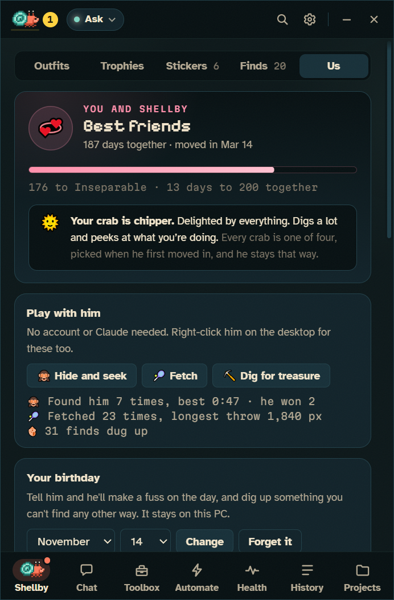
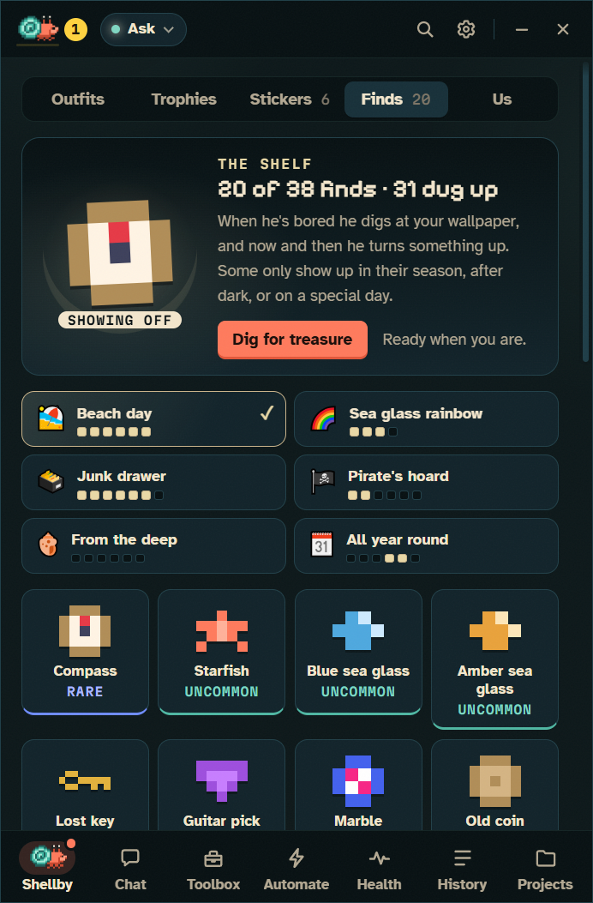
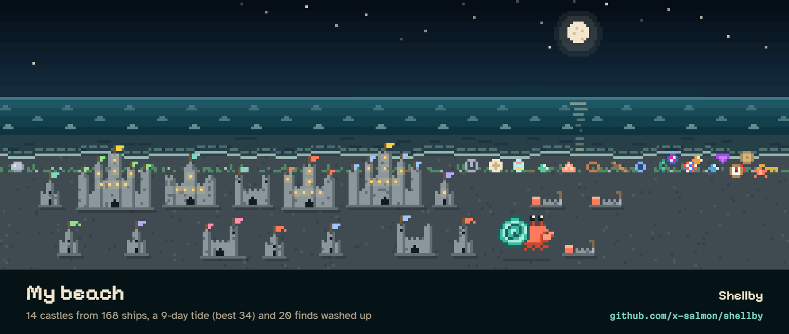
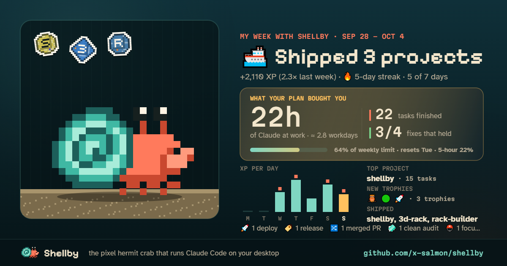
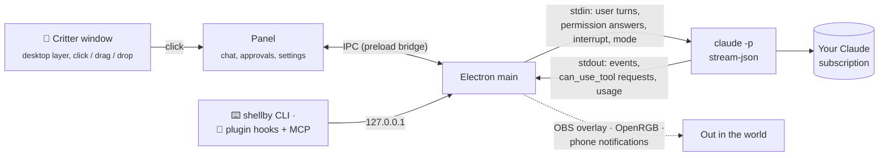

<div align="center">


[](https://github.com/x-salmon/shellby/releases/latest)  [](https://github.com/x-salmon/shellby/releases) [](LICENSE)

## Same Claude Code. Less babysitting.

Parallel tasks on their own branches, undo for any turn, and routines that start the moment your limit resets,<br>
all on **your own Pro or Max plan**, on Windows 10 and 11. No API keys, no per-token billing.<br>
**And a pixel hermit crab who scuttles off to do it.**

### [⬇ Download for Windows](https://github.com/x-salmon/shellby/releases/latest)

[What's new](#whats-new) · [Why Shellby, if you have Claude Code?](docs/WHY-SHELLBY.md) · [Community packs](https://x-salmon.github.io/shellby-packs/) · [How it works](#how-it-works) · [Skins](docs/SKINS.md) · [Security](SECURITY.md) · [Changelog](CHANGELOG.md)

<br>


**1.** Tell him what you want &nbsp;→&nbsp; **2.** Helper crabs work on it side by side &nbsp;→&nbsp; **3.** He brings it home, and you both level up

<sub>([MP4 version](docs/shellby-demo.mp4))</sub>

</div>

**Already use Claude Code?**

- 🧠 **It's the real `claude`.** The official CLI you installed and signed in to. No model of its own, no fork.
- 🔁 **Nothing to migrate.** Your skills, agents, hooks, MCP servers, `CLAUDE.md` files and permission rules carry over, and anything you set up in Shellby works in your terminal too.
- 🛠️ **The difference is the tooling.** Parallel work, undo, review, scheduling and alerts, so you don't have to script them yourself. **[Why Shellby, if you have Claude Code →](docs/WHY-SHELLBY.md)**

**What can it do to my repo without asking?** Only what you've allowed: the default **Ask first** mode asks before every edit and command your own rules don't already permit, and the fenced-off Autonomous mode is never on unless you pick it. A tab can work in its own copy of the repo on its own branch that only merges back when you say so, never with a force-push, and **Undo** puts back every file a turn changed. [Permission modes →](#permission-modes)

---

## Get started

1. **[Download the installer](https://github.com/x-salmon/shellby/releases/latest)** (`Shellby-Setup-x.y.z.exe`) and run it on Windows 10 or 11.
2. Pick **Crab + Claude Code** (uses your Claude Pro or Max plan), **Work mode** (the same, with your tools first on the bar and a quiet crab), or **Just the crab**: no Claude, no account, still a desk pet who talks, plays and dresses up.
3. He moves onto your desktop. Click him to open the panel.

Windows may show a SmartScreen warning the first time; [Install](#install) explains it, along with the Claude Code setup.

## Everything he can do

You start with just him and a chat box. The rest of his shell opens as he works: **History** and **Projects** after his first task, **Health** and the **Toolbox** after his third, **Automate** after his fifth. Can't wait? **More → Show every screen** puts them all on the bar, and [Work mode](docs/DESKTOP.md#work-mode) starts with every one of them.

| | |
|---|---|
| ⚡ **[Gets things done](#-he-gets-things-done-with-claude-code)** | Helper crabs, tabs on their own branches, undo any turn, comments on the diff |
| 🗂️ **[Runs your dev day](#️-he-runs-your-dev-day)** | Every repo and dev server, crash help, flaky tests, time per project |
| 🌊 **[Gets out more](#-he-gets-out-more)** | Your terminal, your phone, CI on your pull requests, your stream and GitHub |
| 🔒 **[Keeps you in control](#-you-stay-in-control)** | Permission cards, five modes, a spending guard, nothing leaves your PC |

**And he's good company**

| | |
|---|---|
| 🦀 **[Lives on your desktop](#-he-lives-on-your-desktop)** | Behind your windows, a voice of his own, focus guard, usage limits |
| 💞 **[Just the two of you](#-just-the-two-of-you)** | Gifts he digs up, games, a bond that grows, a tank to decorate, a beach of everything you ship |
| 🎩 **[Dresses up](#-dress-him-up)** | Outfits, shells and skins you earn, and community packs |
| 🩺 **[Watches your PC](#-he-watches-your-pc)** | He sweats when the GPU runs hot and gets dizzy when memory's full |

## ⚡ He gets things done with Claude Code

<table>
<tr>
<td width="50%"></td>
<td width="50%"></td>
</tr>
<tr>
<td align="center"><sub>Helpers work in parallel, each in its own lane</sub></td>
<td align="center"><sub>Lean Shell shows what every conversation carries</sub></td>
</tr>
</table>

- **Helper crabs:** every subagent gets its own lane in the panel and its own crab on your desktop.
- **Tabs that don't collide:** each tab is its own Claude Code process, and can work in its own copy of the project on its own branch. **Bring it home** merges it back, and never force-pushes.
- **Undo any turn:** each turn ends with the files it changed. Undo puts them back, including what a script or `npm install` did.
- **Comment on the diff:** click a line number in any turn's diff (Shift+click for several) and say what should change: "no, keep this function pure". Comments collect across files and turns, then go back as one follow-up that quotes the code each one is about.
- **What did that cost me:** each turn ends with its tokens, roughly how much of your 5-hour window it took, and how full the context is. The context chip adds up the whole conversation and its costliest turns, and he offers to make room a turn or two before it gets crowded.
- **Learns from your corrections:** make the same review comment twice, Deny the same command twice, or undo changes in the same folder twice, and a card offers to add it as a rule to that project's `CLAUDE.md`, in your own words. It shows exactly what goes in before anything is written, and **Not this one** means he won't suggest it again.
- **Try it another way:** branch from any turn into a new tab, run two approaches side by side, and keep the one you like.
- **A Toolbox for all of it:** every skill, agent, MCP server, hook, rule and `CLAUDE.md`, with an editor for each, a Skill Shop, and **prompt snippets** you can call with `/review`.
- **Talk instead of type:** hold <kbd>Ctrl</kbd>+<kbd>Alt</kbd>+<kbd>Space</kbd> and say the task. Windows hears it, on your PC.
- **Keyboard first:** <kbd>Ctrl</kbd>+<kbd>K</kbd> runs what the mouse can, by name: stop, undo the last turn, try it another way, bring it home, compact, change mode or effort, start the project's dev server, run a routine. <kbd>Ctrl</kbd>+<kbd>/</kbd> lists every shortcut.
- **In your terminal and editor too:** with the plugin he reacts to Claude Code in VS Code, Cursor, Windsurf, Zed, JetBrains and Windows Terminal, and sits in its status line.

**[Everything he does with Claude Code →](docs/CLAUDE-CODE.md)** · **[Already use Claude Code in a terminal or editor? Here's what he adds →](docs/WHY-SHELLBY.md)**

## 🗂️ He runs your dev day

<table>
<tr>
<td width="50%"></td>
<td width="50%"></td>
</tr>
<tr>
<td align="center"><sub>Every repo you work in, and its dev servers</sub></td>
<td align="center"><sub>A crash, with what to send Claude a click away</sub></td>
</tr>
</table>

- **Projects:** the repos you work in, here and on GitHub, with their branches and unpushed work. **Start** a dev server and a `:5173` pill sits by the crab.
- **When a server crashes** he holds up a red sign. The card marks the error lines and shows exactly what would go to Claude, and nothing is sent until you say so.
- **Time on each project:** hours worked out from what he already sees, clients and rates, and a PDF or CSV timesheet. Off until you turn it on, and never synced.
- **Flaky tests** caught and fixed for real, **dependencies** checked weekly with a pull request to bump them, and **Is it safe to leave?** before you lock up or shut down.
- **Workflows and routines:** a schedule, a red build, a release or a file landing in a folder starts a list of steps: Claude, commands, web requests, a question for you. [Workflows](docs/WORKFLOWS.md).
- **Your MCP servers in them:** tick the servers a step may use and Claude files the Linear issue or posts to Slack without stopping to ask, or call one tool directly with no Claude turn at all. Pair it with [n8n](docs/N8N.md) for everything else.

<p align="center"></p>

**[Projects, time, tests and dependencies →](docs/PROJECTS.md)**

## 🌊 He gets out more

<table>
<tr>
<td width="50%" valign="top">

```powershell
shellby do "tidy my Downloads"
shellby do @review
shellby say "all green"
shellby status
shellby time last-week
```

**From any terminal,** and Claude can drive him too, through the plugin's MCP server: have him say what a skill is up to, or celebrate when a release lands. It can't start tasks of its own.

</td>
<td width="50%" valign="top">


</td>
</tr>
</table>

- **📱 Your phone:** a permission prompt, a finished run or a red build can reach it. ntfy is one QR scan, and Telegram finds your chat by itself. Answer Allow or Deny from it if you like.
- **🎥 On stream:** an OBS browser source on a transparent background. **💡 On your desk:** OpenRGB lighting that follows his mood.
- **✅ CI on your pull requests:** a ✗ sign when a build goes red, a dance when it's fixed.
- **Sync and visiting crabs,** with an optional GitHub sign-in that only asks for what you turn on.

**[Phone, stream, lights and GitHub →](docs/CONNECTIONS.md)**

## 🔒 You stay in control

- **Permission cards:** **Allow**, **Always allow** or **Deny**, with <kbd>Y</kbd> / <kbd>A</kbd> / <kbd>N</kbd>. The card warns you when a command runs a script Claude wrote, or an edit touches Claude Code's own setup.
- **Five permission modes,** from Ask first to a fenced-off Autonomous. See [Permission modes](#permission-modes).
- **Spending guard:** routines and workflows stop before they use the share of your 5-hour window you keep for yourself.
- **Your plan, your PC:** no API keys, no telemetry, and your history stays on your PC.

---

That's the work. The rest is what makes him good company.

## 🦀 He lives on your desktop

<p align="center"></p>

- **On the wallpaper layer,** behind every window, still there after <kbd>Win</kbd>+<kbd>D</kbd>. He scuttles while Claude works, raises a claw when it needs you, and naps when it's quiet.
- **A voice and a temperament of his own:** chipper, fussy, cocky or sleepy. *"fingers crossed"* at a test run, *"all green!"* when it passes, *"shipped it"* after a push. He never quotes Claude.
- **He climbs onto your windows,** rides them when you drag them, and gets flung off when you shake them. He **climbs the sides of your screen** and hangs from the top of it, and sticks to the edge when you throw him at it.
- **Pals and mischief, if you like:** up to five little crabs of his own to keep him company on the floor, and an opt-in **cheeky crab** mode in which he pinches your cursor, shoves a window, leaves sandy footprints and drags notes onto your desktop.
- **Work mode, for a quiet crab:** your tools lead the bar, he only speaks up about the work, and the pals, pranks, climbing and confetti take the day off. His needs rest, his progress keeps counting, and turning it off puts every setting back as it was. [More →](docs/DESKTOP.md#work-mode)
- **He guards your focus** in a little helmet, **listens along** in headphones when music plays, **types along** on a little keyboard while you type, **dresses for the weather** outside (a sou'wester in the rain), and hushes when you're on a call.
- **He knows your limits:** when you'll hit your 5-hour window, and a message held for after the reset goes by itself.
- **Run it when my limit resets:** queue heavy tasks ("refactor X", "write tests for Y") on the Routines page. They start when the window resets, overnight too, one after another, with the PC kept awake. Each result goes to your phone, and a task that runs out of usage partway carries on after the next reset.

**[Everything he does on his own →](docs/DESKTOP.md)**

## 💞 Just the two of you

<table>
<tr>
<td width="50%"></td>
<td width="50%"></td>
</tr>
</table>

None of this needs Claude or an account.

- **Little scenes** when nothing's happening: he pounces on your cursor and misses, builds a sandcastle, gets the hiccups. 24 to catch him in.
- **Gifts from digging:** sea glass, a lost key, a pearl, once in a long while a gold doubloon. 86 finds in eleven sets, on a shelf of their own.
- **He remembers you:** from *New friends* to *Inseparable*, with the story of your moments together (*"You shook him off Excel"*), your birthday, and his.
- **Hide and seek, fetch,** and friends' crabs who drop by and chat.
- **A tank to decorate:** a sandcastle, a rock cave, kelp, a treasure chest and the finds he's dug up, arranged where you want them, with him wandering about among it all. Pieces come from the start, from trophies, from the seasons and from his digging, never from a shop. Decorate with the mouse or the keyboard alone. [More about his tank](docs/TANK.md).
- **Snacks and naps:** he gets peckish, sandy, sleepy, and a little mopey if you ignore him. Feed him plankton you earn by getting things done. Gentle by design: it never goes below a floor, never drops while you're away, and never costs you anything.
- **Your beach,** a scene that only grows: a sandcastle for every project you ship (a tower house at 5 ships, a keep at 15, a citadel at 40), the tide coming in with your streak, a line of seaweed where your best one reached, and his finds washed up along it. New castles rise out of the sand while you watch. Drag along it, then share a snapshot of the whole thing.

<p align="center"></p>

**[More about the two of you →](docs/DESKTOP.md#just-the-two-of-you)**

## 🎩 Dress him up

<p align="center"></p>

- **138 accessories, 21 effects and 16 crabs,** head-to-tail sets, and costumes for every season.
- **50+ trophies and 99 levels:** outfits unlock as you use him, and he grows into new shells, from a Snail Shell to the Rainbow Nautilus.
- **A sticker for every project you ship,** drawn from the repo itself, going vinyl, holo and foil as you keep shipping.
- **Cards to share:** a crab card of him as he's dressed, and a weekly one every Friday.

<p align="center"></p>

<table>
<tr>
<td width="50%"></td>
<td width="50%"></td>
</tr>
</table>

More hats, effects, colours and voices (a pirate, a grump, another language) from other people in the **[community gallery](https://x-salmon.github.io/shellby-packs/)**, installed in one click, and you can make your own in Pack Studio.

**[Outfits, trophies, XP and stickers →](docs/WARDROBE.md)**

## 🩺 He watches your PC

<p align="center">
  
</p>

- **Live vitals:** GPU and CPU temperature and load, memory, every drive, drive temperatures, fans and the battery, with 10-minute sparklines.
- **His mood follows your hardware:** he sweats past 80°C, gets dizzy when memory fills up, and overstuffs his shell when a drive is full.
- **What's hogging it,** what starts with Windows, and what Docker, WSL and the package caches are sitting on.
- **"Ask Shellby why"** runs a read-only Claude task that finds the cause. He never deletes or kills anything himself.

<p align="center"></p>

**[How Health works →](docs/HEALTH.md)**

## What's new

<table>
<tr>
<td width="33%" valign="top">

**📅 The weekly crab card** · 0.62<br>
<sub>Every Friday he hands you a card of your week: what you shipped, your streak, your top project and the trophies you earned. [See one](docs/WARDROBE.md#your-week)</sub>

</td>
<td width="33%" valign="top">

**🪶 Lean Shell** · 0.61<br>
<sub>How many tokens every conversation carries before you type, which plugins cost the most, and which sit idle. More out of your plan, without asking Claude to do any less. [How](docs/CLAUDE-CODE.md#lean-shell-more-out-of-your-plan)</sub>

</td>
<td width="33%" valign="top">

**🗂️ Projects and dev servers** · 0.60<br>
<sub>Every repo you work in on one page. Start <code>npm run dev</code>, and if it crashes he holds up a red sign and offers Claude the error. [How](docs/PROJECTS.md#projects-and-dev-servers)</sub>

</td>
</tr>
<tr>
<td valign="top">

**🧪 Flaky test detective** · 0.59<br>
<sub>A test that fails, then passes on the same code, gets caught. One button has Claude find the real cause and prove the fix 20 times over. [How](docs/PROJECTS.md#flaky-tests)</sub>

</td>
<td valign="top">

**✂️ Prompt snippets** · 0.58<br>
<sub>Save "review my diff" once, then <code>/review</code> in the box or <code>shellby do @review</code> in any terminal. [How](docs/CLAUDE-CODE.md#toolbox)</sub>

</td>
<td valign="top">

**⏱️ Time on each project** · 0.57<br>
<sub>Hours per project, worked out from what he already sees, with clients, rates and a PDF timesheet. It never leaves your PC. [How](docs/PROJECTS.md#time-on-each-project)</sub>

</td>
</tr>
</table>

<sub>And before that: a life of his own, gifts from digging, workflows, phone notifications, shell stickers. Everything is in the [changelog](CHANGELOG.md).</sub>

## Install

**Just the crab:** download **Shellby-Setup-x.y.z.exe** (or the portable build) from [Releases](https://github.com/x-salmon/shellby/releases/latest), run it, and pick **Just the crab**. That's it: Health, the Wardrobe, his voice, trophies and crab cards, no account. You can add Claude Code later from Settings.

**Crab + Claude Code:**

1. **Install Claude Code** and sign in with your Claude account (Pro or Max):
   ```powershell
   npm install -g @anthropic-ai/claude-code
   claude auth login
   ```
2. Download **Shellby-Setup-x.y.z.exe** (or the portable build) from [Releases](https://github.com/x-salmon/shellby/releases/latest) and run it.
3. Shellby walks you through a two-step check (CLI found ✓, signed in with a Claude account ✓) and asks how much freedom he gets.

**From a package manager:** instead of downloading the installer,

```powershell
scoop bucket add shellby https://github.com/x-salmon/shellby
scoop install shellby/shellby
```

or `winget install x-salmon.Shellby`, once Microsoft's review of the package finishes. Scoop keeps him up to date with `scoop update shellby` (the in-app updater stands aside); a winget install updates itself like the regular installer.

> **"Windows protected your PC"?** That's Microsoft SmartScreen. It warns about any app that isn't code-signed or that few people have downloaded yet, and Shellby releases aren't signed yet.
>
> - **To install anyway:** click **More info → Run anyway**.
> - **To check you got the real file:** every release is built by [GitHub Actions](https://github.com/x-salmon/shellby/actions/workflows/release.yml) from the tagged commit, and each one lists SHA-256 checksums in `SHA256SUMS.txt`. Compare them with `Get-FileHash .\Shellby-Setup-x.y.z.exe`, or build from source (below).

**Updating:** the installed version updates itself. He checks GitHub Releases, downloads in the background, and puts a dot on the ⚙ gear when an update is ready. Click **Restart and update** in **Settings → About** or the tray menu, or just quit and it installs on the way out. Your settings live in `%APPDATA%\Shellby`, so they carry over. The portable build can't update itself: download the new `Shellby-Portable-x.y.z.exe` from [Releases](https://github.com/x-salmon/shellby/releases/latest) and replace the old one.

**Requirements:** Windows 10 or 11 (x64). For the Claude side: Claude Code 2.1+ and a Claude Pro or Max plan.

## How it works



Shellby doesn't talk to any AI API itself. Each conversation is one long-lived, official Claude Code process that you signed in to yourself, driven over the same stream-json host protocol the Claude Agent SDK uses. Shellby never sees your Claude sign-in, and usage counts against your plan's normal limits, exactly as if you'd typed the task into a terminal. The protocol, billing safety and how he stays on the desktop layer are in [DEVELOPMENT.md](docs/DEVELOPMENT.md#how-shellby-drives-claude-code).

## Permission modes

| Mode | Reads | Edits files | Runs commands | Notes |
|---|---|---|---|---|
| **Ask first** *(default)* | ✅ | asks | asks | Recommended. |
| **Smart** | ✅ | auto* | auto* | Claude Code's `auto` mode: a safety classifier approves routine steps and blocks risky ones. |
| **Auto-edit** | ✅ | ✅ | asks | |
| **Plan only** | ✅ | ✗ | ✗ | Shellby proposes a plan card, and nothing changes until you approve. |
| **Autonomous** | ✅ | ✅ | ✅ | `bypassPermissions`. Behind an explicit warning, never the default, and never reachable from the `shellby` command. |

Your own Claude Code allow/deny rules in `~/.claude/settings.json` still apply in every mode.

## Build from source

`git clone`, `npm install`, `npm start`. The full setup, every test and maintenance script, and a map of the code are in [docs/DEVELOPMENT.md](docs/DEVELOPMENT.md). Every image in this README is rendered from the real app: `npm run screenshots`, `npm run reel` and `python scripts/make-banners.py`.

## Privacy

Everything stays on your PC. Conversation history lives in `%APPDATA%\Shellby\sessions`, and Shellby has no telemetry and no servers. The [privacy policy](PRIVACY.md) lists every connection he makes and what goes over it. In short:

- Claude Code talking to Anthropic, and the updater checking GitHub Releases.
- GitHub, only if you sign in: your profile, the sync gist, pack pull requests, the CI status of your pull requests, with Visiting crabs on, your public calling card and your friends' cards, with Profile card on, the public gist holding your profile card picture, and with Built with Shellby on, the public `shellby-badge` repository holding his picture and the badge at the bottom of pull requests your tabs open.
- Phone notifications, only if you turn them on, straight to the service you picked (ntfy, Pushover, Telegram, Discord, Slack or your own endpoint).
- Things you ask for: community packs, plugins and MCP servers, `git` fetches and pushes, workflow web requests, and the weekly npm dependency check.
- Things that never leave your PC: the time tracker (it reads the title of the window in front to tell which project you're in, keeps only the project, the day and the minutes, and never syncs them), push-to-talk audio (Windows' offline speech recognizer hears it, and the microphone is only open while you hold the shortcut), your PC's health readings, OpenRGB, the OBS overlay, and the port the `shellby` command and the plugin use — all on `127.0.0.1`.

See [SECURITY.md](SECURITY.md) for the renderer sandboxing details.

## Code signing policy

Releases are signed with [Azure Artifact Signing](https://learn.microsoft.com/azure/artifact-signing/), under the maintainer's verified name.

> Signing is being set up. Until the first signed release, releases are unsigned (see [Install](#install)).

Only Shellby's own files are signed, and only when GitHub Actions builds them from a tagged commit in this repository ([release workflow](.github/workflows/release.yml)). The signing key stays in Microsoft's hardware and is never on a PC. Before publishing, the workflow checks that every exe is validly signed by the expected publisher. Before building, it checks that the publisher will match the last release's, so installed copies keep updating. How it works: [docs/SIGNING.md](docs/SIGNING.md).

- **Committers and reviewers:** [x-salmon](https://github.com/x-salmon). Pull requests from anyone else are reviewed before they're merged.
- **Release and signing:** [x-salmon](https://github.com/x-salmon)

Everyone in these roles uses two-factor authentication on GitHub and Azure.

**Privacy:** see the [privacy policy](PRIVACY.md) for everything Shellby sends over the network, and when. It has no telemetry.

## Contributing

Skins, packs, bug reports and PRs are welcome. See [CONTRIBUTING.md](CONTRIBUTING.md).

## License

Shellby is free software under the [GPL-3.0](LICENSE). Read him, change him, share him, build on him. The one condition: if you hand out a changed version, it stays open under the same licence, so fixes find their way back to everyone instead of disappearing into a closed-source app.

The name **Shellby** and the crab as a mascot aren't part of that licence. Fork the code all you want — just give your crab its own name, so nobody downloads yours thinking it's this one. [TRADEMARK.md](TRADEMARK.md) spells out what's reserved and what's fair game.

Copyright stays with x-salmon, so there may one day be paid extras alongside the free crab. The app in this repository stays GPL-3.0 and free.

## Disclaimer

Shellby is an independent open-source project. It is **not affiliated with, endorsed by, or sponsored by Anthropic**. "Claude" and "Claude Code" are trademarks of Anthropic, PBC. Shellby only automates the official Claude Code CLI you install and sign in to yourself, and your use of it is subject to [Anthropic's terms](https://www.anthropic.com/legal/consumer-terms).

Shellby acts on your real files with your real permissions. Read what you approve, and keep backups.

<sub>GPL-3.0 licensed, see [LICENSE](LICENSE) and [TRADEMARK.md](TRADEMARK.md). The bundled fonts, Pixelify Sans, Atkinson Hyperlegible and Martian Mono, are under the SIL Open Font License 1.1 (see [assets/fonts](assets/fonts)).</sub>
