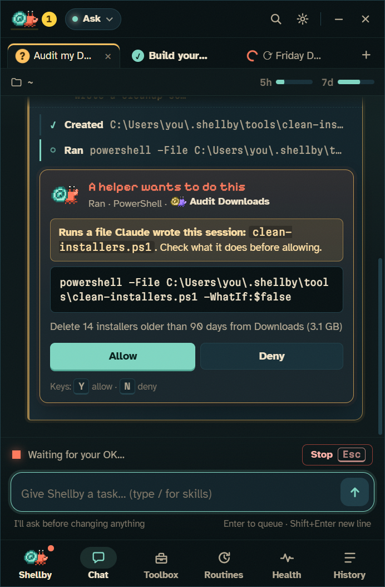
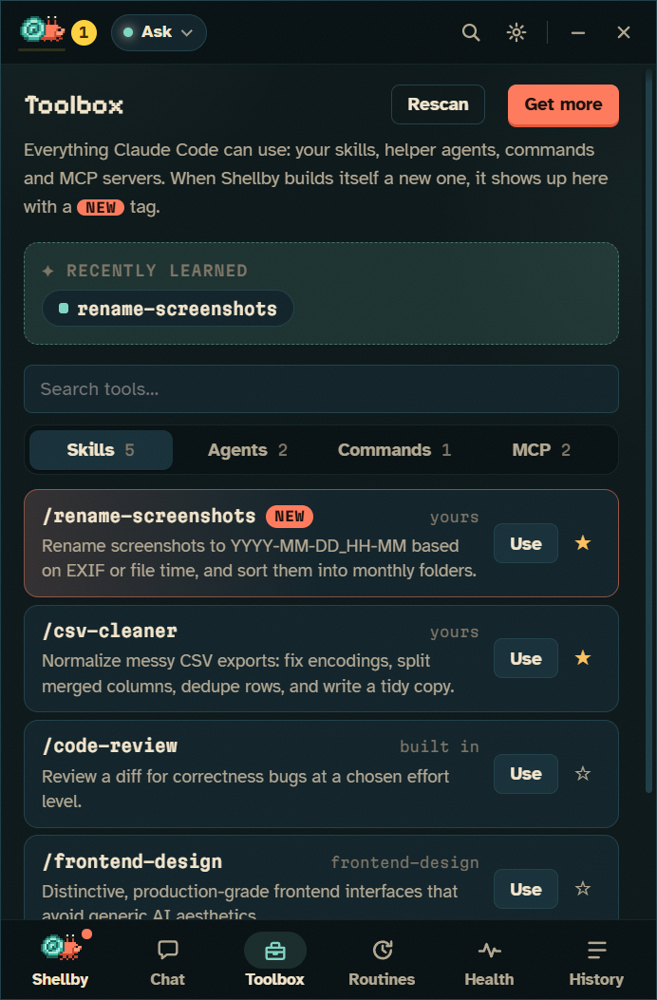
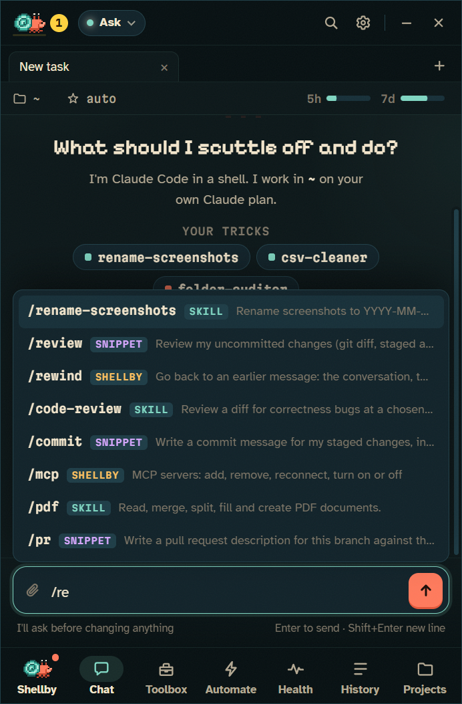
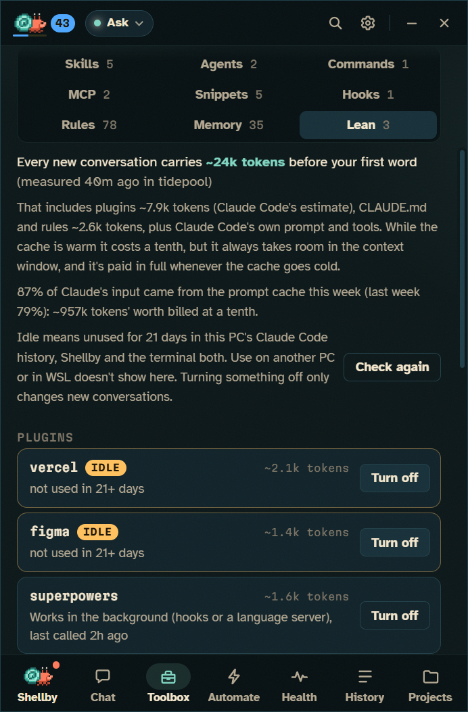
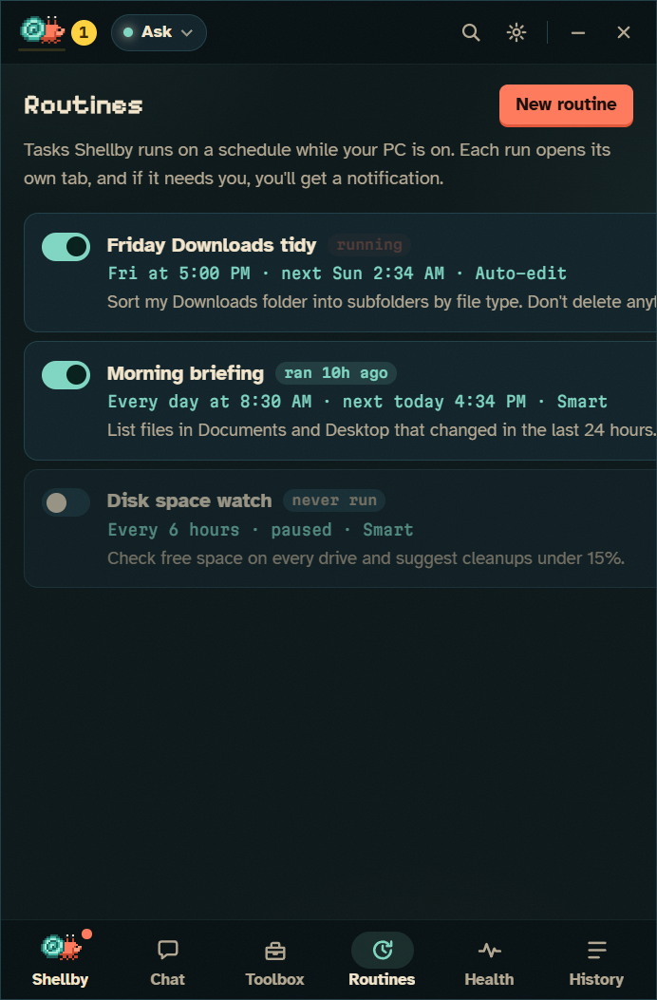

# Shellby and Claude Code

Everything Shellby does with Claude Code, on your own Claude Pro or Max plan. Back to the [README](../README.md). Already using Claude Code in a terminal or editor? [Why Shellby](WHY-SHELLBY.md) compares the two.

<table>
<tr>
<td width="50%"></td>
<td width="50%"></td>
</tr>
<tr>
<td align="center"><sub>Helpers work in parallel, each in its own lane</sub></td>
<td align="center"><sub>Skills and agents he builds show up in his Toolbox</sub></td>
</tr>
</table>

## Conversations

- **Helper crabs:** each subagent gets its own lane in the panel and its own crab on your desktop.
- **Crew view:** each helper's lane shows its task, live activity, tool count, tokens and time. Click a helper crab on the desktop to jump to its conversation. When a helper needs permission, the card shows up in its lane, labelled with which crab is asking.
- **Parallel tabs,** each its own Claude Code process. Build a tool in one tab while you use it in another. <kbd>Ctrl</kbd>+<kbd>T</kbd>, <kbd>Ctrl</kbd>+<kbd>W</kbd> and <kbd>Ctrl</kbd>+<kbd>Tab</kbd> work like a browser, and so does dragging one along the strip. <kbd>Ctrl</kbd>+<kbd>Shift</kbd>+<kbd>PageUp</kbd>/<kbd>PageDown</kbd> moves one without the mouse, and they come back in the order you left them.
- **Queue:** Enter queues a message while he's busy, and it's sent when the current turn finishes. Click a queued message (or press <kbd>↑</kbd>) to edit it. Stopping hands the queue back to you instead of firing it.
- **Say it instead (push-to-talk):** turn on **Settings → Shortcut → Hold it to dictate a task**, then hold <kbd>Ctrl</kbd>+<kbd>Alt</kbd>+<kbd>Space</kbd> and say what you need. He shows *listening…* while you hold it, and when you let go your words are waiting in the box to read and send. A tap still opens Shellby as before. Windows' own speech recognition does the listening, on your PC, with nothing to install or sign up for.
- **The terminal's keys, in the box:** <kbd>Esc</kbd> <kbd>Esc</kbd> (or `/rewind`) takes the conversation, the code or both back to before an earlier message. `!` runs a command yourself and hands its output to Claude, `@` finds files in the project, <kbd>↑</kbd> and <kbd>Ctrl</kbd>+<kbd>R</kbd> bring back what you've sent, and `/export` saves the conversation as Markdown. A chip sets how hard Claude thinks (effort), and Settings picks the output style.
- **Chats you can tick off:** a ✓ on every row in History marks a conversation done, so the twenty you've finished with stop burying the two you haven't. Nothing is deleted, and sending it something new un-ticks it.
- **While you were away:** come back after an hour or more and a short recap is waiting above the box: what finished, what failed, what's waiting on you, and roughly how much of your 5-hour usage window each conversation took. Click a row to open that conversation. Turn it off under **Settings → System**.

<p align="center"></p>

## Your code, safe

- **See what every turn changed:** in a git project, each turn ends with a **± files changed** block. Open a file for its diff, or press **Undo** twice to put the files back the way they were before that turn. It catches everything, including what a script or `npm install` did, and it never touches your staging area. Undo refuses if a file has changed again since, so it can't eat later work.
- **A copy of the project for each tab (optional):** **Settings → Working folder → Give each new conversation its own copy** puts each new tab in a git worktree on its own branch, so two tabs in one repo stop stepping on each other. The branch shows next to the folder; **Bring it home** commits what's left, merges it into the branch it came from and tidies the copy away. If the merge would clash, nothing is merged, and he can sort it out on his own branch. **Bring it home and push** goes on to send the branch to its remote.
- **Try again from any turn:** hover one of your messages and press ⑂ to try it again in a new tab, changed or exactly as it was, or press **⑂ branch** under a reply to carry on from there. The new tab remembers the conversation up to that point and works in its own copy of the project with the files exactly as they were then, while the original carries on untouched. Two approaches run side by side without touching each other. The branch chip compares two tries file by file, and **Keep this one** brings your favourite home and throws the other tries away. `/branch` does the same from the box.
- **Push to GitHub from the folder menu:** in a git project the folder menu shows how far your branch is ahead of and behind its remote. **Push** fetches, merges in anything the remote has that you don't (a merge, never a rebase), then pushes. It never force-pushes. If the remote's work clashes with yours, nothing is merged or pushed, and he can sort it out. If a pre-push hook refuses, what it said is written into the conversation. Before anything leaves your PC, every push Shellby makes looks over the commits it would send for API keys, tokens, private keys and files like `.env` or `id_rsa`. If it finds one, it shows you where (never the value) and asks: **Push anyway**, **Ask Claude to take them out**, or **Don't push**. **Bring all home** merges every copy with work waiting into your branch, one at a time, and stops at the first one that clashes. **Bring all home and push** then pushes.
- **Look over my changes:** the shield next to a project in **Trophies** sends the work you haven't pushed yet for a read-only security read. He reports what looks risky, worst first, and changes nothing, and he won't tell you you're secure.

## Toolbox

- **Everything Claude Code can use:** every skill, agent, command and MCP server, plus the hooks and `CLAUDE.md` memory files that set it up, with an editor for each. When he writes himself a new tool, he celebrates, even if he wrote it while Shellby was closed. New skills and agents are tagged **new** and can be pinned as one-click chips on the start screen, and <kbd>/</kbd> in the composer autocompletes all of them.
- **Hundreds of skills, still findable:** show just yours, the project's, the built-in ones or one plugin's, and sort by **Most used** or **Unused first** (the unused ones costing the most in every conversation come first). Long lists are drawn 150 at a time, with **Show more**. Your own skills, agents and commands open in an editor right there, which won't save over a change made somewhere else.
- **MCP servers** show their connection status, and can be added, removed, reconnected or turned off.
- **Prompt snippets:** save what you ask for again and again ("review my diff", "write tests for this file") in **Toolbox → Snippets**, then type `/review` in the box, click it pinned on the start screen, or run `shellby do @review` in a terminal. `$ARGUMENTS` in a snippet stands for whatever you type after its name, and `$1`, `$2`… for the words one at a time (the last takes the rest, so `/fix 42 the login page 500s` fills "Fix issue #$1: $2"). The editor marks the blanks as you type, checks the name before you save, and lets you add a hint for what goes after the name (shown in the slash menu and `shellby snippets`) or set a snippet to start a new conversation each time. Each one shows how often you've used it; the ⋯ menus duplicate, copy, delete, import and export them as a file, or bring back the starters. `/snippets save` keeps the last thing you sent (with a name, straight away; without, in the editor), and `/snippets new` opens a blank one. It starts you off with review, tests, explain, commit and pr.
- **Permission rules:** **Toolbox → Rules** lists the allow, ask and deny rules from your settings and the project's, and adds or removes them. Anything that lets Claude do more on its own asks first in the isolated confirmation window.
- **Hooks and memory:** **Toolbox → Hooks** lists every hook in your settings, the project's and your installed plugins', and adds, edits or removes your own. Each change asks first in the isolated confirmation window, shows the exact command and keeps a backup of the settings file. **Toolbox → Memory** opens your `CLAUDE.md`, the project's, `CLAUDE.local.md`, `.claude/rules/` and any `CLAUDE.md` in the folders above, in an editor that won't save over a change made somewhere else.
- **Team packs:** **Toolbox → Team** saves the snippets, workflows, hooks and rules you pick as `.shellby/team.json` in the repo. Commit it, and anyone who opens the repo in Shellby is told it's there and can set up the same way in a few clicks. Nothing in a pack runs on its own. [How team packs work](TEAM-PACKS.md)
- **Skill Shop:** **Toolbox → Get more** lists every plugin in your marketplaces, most popular first. Add marketplaces from GitHub, and every install asks first in an isolated confirmation window. It uses Claude Code's own plugin system, so whatever you install works in your terminal and editor too.

## Lean Shell: more out of your plan

<p align="center"></p>

More out of your Claude plan, without asking Claude to do any less. Nothing here changes a prompt, the model, the effort level or what Claude reads and writes.

- **What every conversation carries.** **Toolbox → Lean** says how many tokens a new conversation carries before your first word, measured from its first call: Claude Code's own prompt and tools, every plugin's skill and agent listings, and your `CLAUDE.md` files.
- **Plugins, priced.** Each plugin shows what Claude Code itself estimates it adds to every conversation. A plugin or MCP server that hasn't been used in 21 days, in Shellby or in Claude Code in the terminal on this PC, is marked **idle**, with a **Turn off** that's easy to undo. Plugins that work without being called (hooks, output styles, a status line) are never idle.
- **CLAUDE.md and rules.** Your memory files are listed with their sizes, and rules that only load for matching files are kept apart from the ones every conversation carries. **Suggest a trim** puts a prompt in a new tab, unsent, for Claude to propose a shorter version.
- **The prompt cache.** A dot on the context chip says whether this conversation's cache is warm, cooling or cold, and its menu explains what that means: after a break, the next message re-reads the conversation at full price, once.
- **What a task usually costs.** Each turn that finishes notes what it took of your 5-hour window, with its project, its model and what kind of ask it was (a fix, a review, tests, a question…). Type a few words and a quiet line under the box says "usually about 8% of your window"; hover it to see what that's drawn from ("from 12 similar fixes in shellby"). It needs three similar tasks before it guesses, and the prompt itself is never kept, only its kind. It all stays on this PC, for 60 days, and **Clear all history** clears it.
- **A heads-up before a big one.** If what you're typing usually takes more than you've got left (before the share you keep with the spending guard, or the limit itself), the banner above the box says so: "This usually takes about 20% and you've 12% left before he stops." **Send anyway** or **Send after the reset**: it's your call, and Enter still sends. Turn on **Hold big tasks for the reset when I'm close to the limit** (**Settings → General → Usage limit**) and he holds those for you, with a **Send now** if you change your mind. Routines and workflows have the spending guard instead.
- **XP for tidying.** Turning off a plugin or server that sat idle is worth XP, once for each one, and so is starting a crowded conversation fresh with a summary. Nothing pays for cheaper tasks, shorter replies or fewer of them.

## Automate

<p align="center"></p>

- **Routines** run a single task on a schedule, like "every Friday at 5, tidy Downloads". Each run opens its own tab with its own permission mode, and missed runs catch up when your PC wakes up. Or just describe one and Claude fills in the form for you to check and save. Name a project you work in ("check my shellby repo every morning") and Claude finds its folder.
  - **Build it with Claude.** The routine editor has a chat beside it: say what to change and Claude changes the form while you watch, and with **Let Claude test it** it runs the routine once and fixes what went wrong. See [Routines too](WORKFLOWS.md#routines-too).
  - **Fix with Claude.** A routine whose last run failed has a **Fix with Claude** button. Claude reads that run's conversation, opens a corrected routine in the editor and says in the chat what went wrong and what it changed. It keeps the routine's permission mode unless the mode was the problem.
  - **A model of its own.** A routine can run on a lighter model than your usual one: a lighter model is plenty for tidy-ups and summaries. Pick it under **Model** in the editor, or let Claude pick one when it drafts the routine. If a routine's runs on the top model have all been small, the editor says "Runs like this usually suit Sonnet". It never changes it for you. Tasks queued for the reset can have their own model too.
  - **Needs a workflow?** If what you describe should start on an event (a failed build, a new file), needs steps with decisions between them, or should ask you something part-way, Claude says so and offers **Build it as a workflow instead**, which drafts it in the workflow editor.
- **Workflows:** something happens (a schedule, a red build, a release, a file landing in a folder, a script calling a web hook, Claude Code asking) and Shellby runs a list of steps: Claude, PowerShell commands, web requests, files, a question for you, a message to your phone. Describe one in a sentence and Claude writes it for you to check. [Everything workflows can do](WORKFLOWS.md).
- **Dependency checkups:** the **Dependency checkup** template runs `npm outdated` and `npm audit` (or the pnpm, Yarn, Bun, pip, Poetry, Cargo, Go, Bundler, Composer or .NET equivalent) in every project in a folder, once a week, without changing anything. Shellby reads what each check actually printed, not just how it exited, so a piped or `|| true` run can't pass for clean. **Routines → Dependency health** lists what each project's last checkup found, and a clean audit earns XP and the project's sticker its 🧼 **Fresh** mark.

## Claude Code everywhere

- **The plugin:** one click in **Settings → Claude Code everywhere**, or `/plugin marketplace add x-salmon/shellby` then `/plugin install shellby@shellby` in Claude Code. He scuttles while Claude works, raises a claw when it needs permission, celebrates finished turns and sends out helper crabs for subagents, in your terminal and editor sessions too: *"shellby in Cursor"*, VS Code, Windsurf, Zed, JetBrains, Windows Terminal. See [claude-plugin/](../claude-plugin/).
- **Status line:** `🦀💨 Shellby working · Lv 5 Claw Coder ▰▰▰▱▱ · 🥵 GPU 84°C · +25 XP`, right under the prompt in the terminal and VS Code. Turn it on in **Settings → Claude Code everywhere → Status line** (it asks first, keeps a backup, and restores your old status line if you remove it), or run `/shellby:statusline`. In the classic cmd.exe console, which can't draw emoji, it switches to a plain-text line.
- **Claude Code somewhere unusual?** **Find it myself…** in setup takes a portable copy or another drive, and checks the file really is Claude Code before keeping it.

### ⌨️ From any terminal

```powershell
shellby do "tidy my Downloads"   # a task, in this folder
shellby do @review               # one of your saved prompt snippets
shellby do @tests src/app.js     # ...with what it's about filled in
shellby say "all green"          # a line in his bubble
shellby status                   # him, and how this PC is doing
shellby flow run "Release notes" version=1.2.0   # start a workflow that allows it
shellby time last-week           # hours on each project, ready for an invoice
```

**Settings → Claude Code everywhere → the shellby command** puts it on your PATH, appended so it can't shadow anything, and removing it restores your PATH exactly. Starting a task needs a token only Shellby's own folder holds, and **Autonomous isn't reachable from a terminal at all.**

### 🤖 Claude can drive him

The plugin brings an MCP server with four tools (`say`, `celebrate`, `wear` and `status`), so a skill can have him say what it's up to, celebrate when a release actually lands, or check the GPU before kicking off something heavy. **It cannot start tasks of its own**: spending your subscription isn't something a local port gets to do. The one exception is a workflow you gave the **Claude Code** trigger yourself, which `run_workflow` can start.

**Claude can build workflows, too.** `add_workflow` proposes one (Claude knows the whole format) and `list_workflows` shows what you have. Shellby's confirmation window shows what it would do without asking, in full: every command, every prompt Claude would act on, every web address. Nothing is saved until you say yes, and Autonomous is never on offer.

**Claude can set up routines for you, too.** Say "every weekday at 8:30, summarise what changed in my Documents" in any Claude Code session and Claude writes the routine with `add_routine` (and checks your existing ones with `list_routines`). Shellby then shows you the whole thing in his own confirmation window: the name, schedule, folder, mode and every word of the prompt. **Nothing is saved until you say yes there**, and Autonomous is never on offer. No plugin? Type the same sentence into **Routines → Draft it** and Claude fills in the form instead.

## You stay in control

- **Permission cards:** **Allow**, **Always allow** or **Deny**, with <kbd>Y</kbd> / <kbd>A</kbd> / <kbd>N</kbd>. Claude's multiple-choice questions get cards too: press <kbd>1</kbd>–<kbd>9</kbd>, pick several, type your own answer, or **Skip**.
- **Self-built tooling gets flagged:** the card warns you when a command runs a script Claude wrote earlier in the conversation, or an edit touches Claude Code's own setup (skills, agents, hooks, settings, `CLAUDE.md`).
- **Five permission modes,** from Ask first to a fenced-off Autonomous. See [Permission modes](../README.md#permission-modes).
- **Billing safety:** Shellby never sees your Claude sign-in. If `ANTHROPIC_API_KEY` or another provider is set on your PC, Settings warns that Claude Code may bill that instead, and **Always use my Claude plan** leaves them all out. How Shellby drives Claude Code is in [DEVELOPMENT.md](DEVELOPMENT.md#how-shellby-drives-claude-code).
