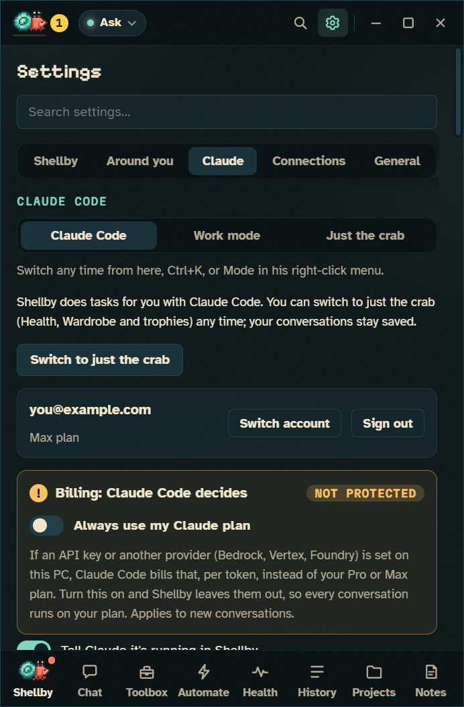

# Out in the world

Your phone, your stream, your desk lights, your Discord profile, your pull requests and your GitHub account. All optional, all off until you turn them on. Back to the [README](../README.md).

## 📱 Your phone

- **Tell me when I'm away:** a permission prompt, a finished run, a reset usage limit, a red build or an overheating GPU can reach your phone. **ntfy** is one QR scan with no account; **Telegram** finds your chat by itself; **Pushover**, a **Discord** or **Slack** webhook, or your own endpoint work too. Nothing goes through a server of ours, a four-second task doesn't buzz your pocket, and **Guard my focus** holds them back unless you say otherwise.
- **Answer from your phone (optional):** with Telegram or ntfy, **Let me answer Allow or Deny from my phone** puts the two buttons on the notification. Each prompt gets its own single-use code that expires after 30 minutes. Only your private chat with the bot counts, and an ntfy topic has to be one nobody will guess. Questions, plans, **Always allow**, long commands, and anything the card would warn you about still wait for you at the desk.
- **Start a task from your phone (optional):** with Telegram or ntfy, **Let my phone start tasks** turns a message into a Claude Code task. Pick the folder they go to first; name another project with `in <project>: <task>` or `@<project> <task>`. `/status` says what's running and what's waiting for you, and `/help` says how. Every phone task runs in **Ask first**, whatever mode you use at the desk, in its own copy when the folder is a git repository, so each edit and command comes back to your phone for Allow or Deny. Its tab is marked 📱 and it always tells your phone when it's done. On Telegram only your own private chat with the bot counts. On ntfy you post to `<topic>-tasks`, and since anyone who knows an ntfy topic can post to it, each message starts with a passphrase Shellby makes up and shows you once. At most 10 an hour and 3 at once; past your spending guard's share, it waits for the reset. `!` commands, Claude Code's `/` commands, modes and settings never come from the phone.

## 🎥 On a stream

**Settings → Around you → On a stream** serves him as an OBS browser source on a transparent background: the same crab, outfit and animations, reacting live in the corner. It's the critter's own stylesheet behind it, on 127.0.0.1 only.

## 💡 Desk lighting

Through [OpenRGB](https://openrgb.org): coral while he works, amber when he needs you, red when a build goes red or something overheats. **Install OpenRGB for me** does it with winget after you confirm, and he starts it in the tray whenever the lighting is on.

## 🎮 On your Discord profile

**Settings → Around you → On your Discord profile** puts him under your name the way a game shows up: *Lv 12 Abyssal Admin · working with Claude Code*, with a clock for how long he's been at it. Shellby talks to the Discord app on your PC, so there's nothing to sign in to. **Say what the task is** shows the running task's title instead, never in Work mode. With Visiting crabs on, a **Visit my crab** button links your calling card, so the people who see it can add you.

## ✅ CI on your pull requests

Sign in with GitHub, and when a build goes red he holds up a ✗ sign, when it's fixed he dances, and a review request makes him raise a claw. **Ask Shellby why** reads the failing logs and explains them without changing anything. **Fix this build** goes further: it shows you the failing part of the log it would send, then Claude fixes it in a copy started from the pull request and pushes to its branch. The red build's notification opens the same sheet. **Address the review** does the same with the review comments still unresolved. More in [Projects](PROJECTS.md).

## GitHub sign-in

Sign in with a short code you approve on github.com, with no password typed into Shellby. GitHub is only asked for what the features you turn on need:

- **Sync between PCs:** trophies, collected items, XP, streak days, outfit and color, shell stickers, the Bugdex, his finds, his bond with you and the moments he remembers, games played, quests, his personality, his tank's layout, your friends list and your settings, through a private gist. Syncing only ever adds progress, except that a find you swap away stays gone on every PC; the tank follows whichever PC you decorated on last, each setting whichever PC changed it last, and a friend added or removed on one PC is added or removed on the others. Settings that belong to one PC stay on it: where he sits, the folder Claude works in, the Claude Code path, start at login, push-to-talk, crash reports, ports and anything secret. Autonomous mode never syncs: each PC confirms it itself.
- **Visiting crabs:** add friends by GitHub username and their crab drops by your desktop now and then, wearing their outfit, and leaves a souvenir in your guestbook. You can also invite them over or send a wave (a few fixed lines, so nobody can put words in your crab's mouth). It works through a small public "calling card" gist with your crab's look and level, and nothing else unless you choose (his stickers in the Sticker Book, his tank under **Tank → On your cards**, so friends can peek at it). Waves are comments on it, and only friends you added get through. Turning it off, or signing out, deletes the card. Its own switch, never turned on by a first sign-in.
- **Profile card:** your crab, level, streak and five latest stickers as an SVG on your GitHub profile, the way stats cards work. Shellby keeps the picture in a public gist (`shellby-profile.svg`) and refreshes it when your crab changes; it hands you a small GitHub Action and one README line for your profile repository (the public repo named after your username), and the Action copies the picture in every six hours. Shellby never writes to your repositories itself. Turning it off, or signing out, deletes the gist. Its own switch, never turned on by a first sign-in.
- **Built with Shellby:** when a Shellby tab opens a pull request (`gh pr create`, or a workflow's "Open a pull request" step), a small picture of your crab, dressed as he is now, goes at the bottom of its description with your level and a link to Shellby. GitHub only shows a description's image when it's served as one, which gists aren't, so the picture lives in a public repository Shellby makes on your account, `shellby-badge`. Each new look is a commit there, and each pull request links to its own commit, so it keeps the outfit he wore that day. Only your own pull requests get it, and only once. Turning it off stops new badges but leaves the repository, so older badges keep working. Its own switch, never turned on by a first sign-in.
- **Watch CI on your pull requests**, as above. Public repos need nothing beyond the sign-in; private ones need "Let Claude tasks push" too.
- **Offer to take on issues** assigned to you or labelled `shellby` (in your own repositories, and the ones cloned here that you can push to). A new one starts any workflow with the Issue trigger, like the Issue helper template: he offers to take a crack at it and turns a yes into a draft pull request (see [Workflows](WORKFLOWS.md#from-an-issue-to-a-pull-request)). Public repos need nothing beyond the sign-in; private ones and the pull request need "Let Claude tasks push" too.
- **Your repositories on the Projects page**, to clone the ones that aren't on this PC yet.
- **Publish your Wardrobe packs** to the community gallery: Shellby forks it and opens the pull request for you.
- **Let Claude tasks push:** Shellby's tabs get your sign-in for `git push`/`pull`, `gh` and the official GitHub plugin. Off by default, with a warning before it's turned on.
- **…including changes to CI workflows:** its own switch, off by default, because a workflow runs on GitHub's machines with your repository's secrets. It can't be granted by a first sign-in.

Your name and avatar show in Settings and on your crab card. The sign-in is encrypted by Windows and never stored in settings.json.
