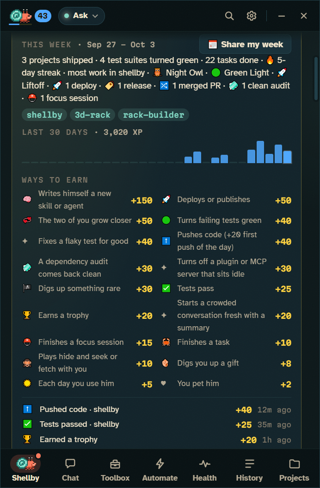

# Dressing him up

Outfits, shells, trophies, XP, stickers and the cards you can share. Back to the [README](../README.md).

## Outfits

- **138 accessories, 21 effects and 16 crabs** for his hat, face, neck, claw and shell. They move with him: a pumpkin swings with his claw, and eyewear scans along while he reads.
- **Head-to-tail sets:** a dev desk with a rubber duck, a tide pool he'd actually come from, and an on-call kit with a pager and an extinguisher. Each covers every slot.
- **He grows into new shells:** level 3 brings a Snail Shell, then a Tin Can, a Teacup, a Toy Brick, the Golden Conch at level 20, and on up through a Coconut Half, a Lantern Jar, a Diving Helmet, a Crystal Geode and a Treasure Chest to the Rainbow Nautilus at level 99. Each is a little molt on your desktop: out of the old shell, a shiver, into the new one. Pick any home you've grown into under **Outfits → Homes**.
- **Seasons:** he dresses up for Halloween, winter, Valentine's, spring, summer and autumn, and seasonal items are yours to keep if you're around while the season is on.
- **Helper crabs wear matching hats,** and every crab in the app is dressed the same way.
- **Outfit codes** like `SHB-B1T7-2DB1-7MXH-JW90` share a look: paste someone's code into **Wear a code…** and Shellby previews it on your crab, then puts it on. Locked items show which trophy unlocks them, and items from packs you don't have come with a **Get pack** button. Codes are typo-proof and need no server.

<table>
<tr>
<td width="50%"></td>
<td width="50%"></td>
</tr>
</table>

## Trophies and XP

- **50+ trophies**, a few of them secret, unlock outfits as you use him: the rubber duck arrives when you let him run a script he wrote, the barnacles after seven days together. Finish 10 tasks for a hard hat, send out your first helper for a captain's hat, finish a task after midnight for a nightcap, free up a full drive for a broom. Trophies hand out two or three things each, and unlocks celebrate on your desktop with confetti. Or flip **Unlock everything**.
- **XP and levels,** from Hatchling to Shellby Supreme at level 99, with a new title, badge colour or shell at least every five levels.
- **XP sources:** a new skill or agent he writes for himself (+150, usually a level-up), deploys (+50), turning failing tests green (+40), pushes (+40, and +20 for the first push of the day to a project), a clean dependency audit (+30, once a day per project), passing tests (+25), trophies (+20), focus sessions (+15) and finished tasks (+10). Petting, games, finds and growing closer earn XP too, so a crab-only Shellby levels up as well. It counts in Shellby and, with the plugin, in your terminal too. "+25 XP" floats up from him on the desktop. Doing the same thing over and over within an hour pays half, then a quarter, then nothing, so a test loop can't farm it.
- **Bonuses:** a streak adds 5% a week (up to +25%), and coming back after three days or more away doubles your next 150 XP.
- **Daily bounties:** three small goals a day ("Push to 2 different projects", "Turn failing tests green"), the same three on every PC. Each pays XP, and clearing all three pays 50 more.
- **Trophies & XP:** click the level badge next to him in the title bar to see his level, what the next level unlocks, today's bounties, XP for the last 30 days and by kind, the XP log and your streak. The badge changes colour every ten levels.
- **Across PCs:** with GitHub sync on, XP earned on each PC adds up.

## Your week

- **Trophies & XP → This week** sums up the last seven days: tasks done, your streak, your top project (the repo with the most finished tasks), new trophies, projects shipped, tests turned green, flaky tests fixed, deploys, releases and clean audits.
- **📅 Share my week** makes a weekly crab card, with the week's stickers on his tank and XP for each day. Every Friday afternoon after a week with something done in it, Shellby hands you the card, ready to share. Projects you keep off your calling card stay off it.

## Shell stickers

 

- **A sticker for every project you ship:** the first time you push, deploy or release a repo (or a pull request of yours is merged), he holds up a sticker drawn for it and slaps it on his shell.
- **Drawn from the repo itself:** a shape, a pattern and its first letter, in the colour of the language it's mostly written in, so the same repo gets the same sticker on every PC. Shipping counts from Shellby's tabs, from Claude Code in your terminal (with the plugin), and from pull requests merged on GitHub (with CI on).
- **It gets shinier as you keep shipping:** paper, then **vinyl** at 5 ships, **holo** at 15, **foil** at 40. Deploys and releases count double, and a burst of pushes counts once an hour. Leave a project alone for two months and its sticker starts to peel at the corner; the next ship presses it back down. Releases, deploys and merges add little marks (🚀 Live, 🥇 One-point-oh, 🔀 Merged), a clean dependency audit adds 🧼 Fresh, and there are a couple of secret ones.
- **The Sticker Book** (Shellby's screen → **Stickers**) has a page for every project: when it first shipped, how often, its marks, and **Pick up where we left off**. Click a sticker and a spot on his shell to move it (or drag it there), and stack them like a laptop lid. On a spot, <kbd>[</kbd> and <kbd>]</kbd> change which is on top, <kbd>F</kbd> flips one and <kbd>Delete</kbd> peels it off. Projects you've worked in but not shipped wait there as question marks.
- **Every shell keeps its own stickers.** When he outgrows a shell, his three most-shipped stickers come with him and the rest stay on the old one, so you can move back in any time. A repo can ship its own official sticker as [`.shellby/sticker.json`](ADDONS.md#repo-stickers).
- **Friends can see them too.** With Visiting crabs on, a friend's crab arrives wearing its stickers. Nothing about yours goes on your public calling card until you choose, in the Sticker Book: **His shell** shares the stickers on his shell as patches of colour (no names or letters), and **Shell and names** adds your three most-shipped, so a friend's visit can leave you one of theirs as a swap.

## The crab card

**📸 Share** on Shellby's screen makes a card with Shellby as he's dressed, your best trophy, task count and trophy shelf. It's copied to your clipboard and saved to `Pictures\Shellby`. Sharing one earns a trophy too.

## Community wardrobe

More hats, effects, colors and voices from other people at **[x-salmon.github.io/shellby-packs](https://x-salmon.github.io/shellby-packs/)**.

- **Install in one click:** every item is previewed on a live Shellby, and the app shows exactly what a pack contains before it installs.
- **New voices:** packs can teach him to talk like a pirate, grumble like a grump, or speak another language, with little scenes to match. He ships with three to try under **Wardrobe → Voice**.
- **Safe by design:** packs are pixel art, short lines and settings in JSON, so they can't run code, and each download is checked against the gallery's SHA-256.
- **Make your own** in [Pack Studio](https://x-salmon.github.io/shellby-packs/studio.html), then publish it from the app (Shellby forks the gallery and opens the pull request) or by hand on [x-salmon/shellby-packs](https://github.com/x-salmon/shellby-packs). The format is in [ADDONS.md](ADDONS.md) ([JSON Schema](addon.schema.json)).
